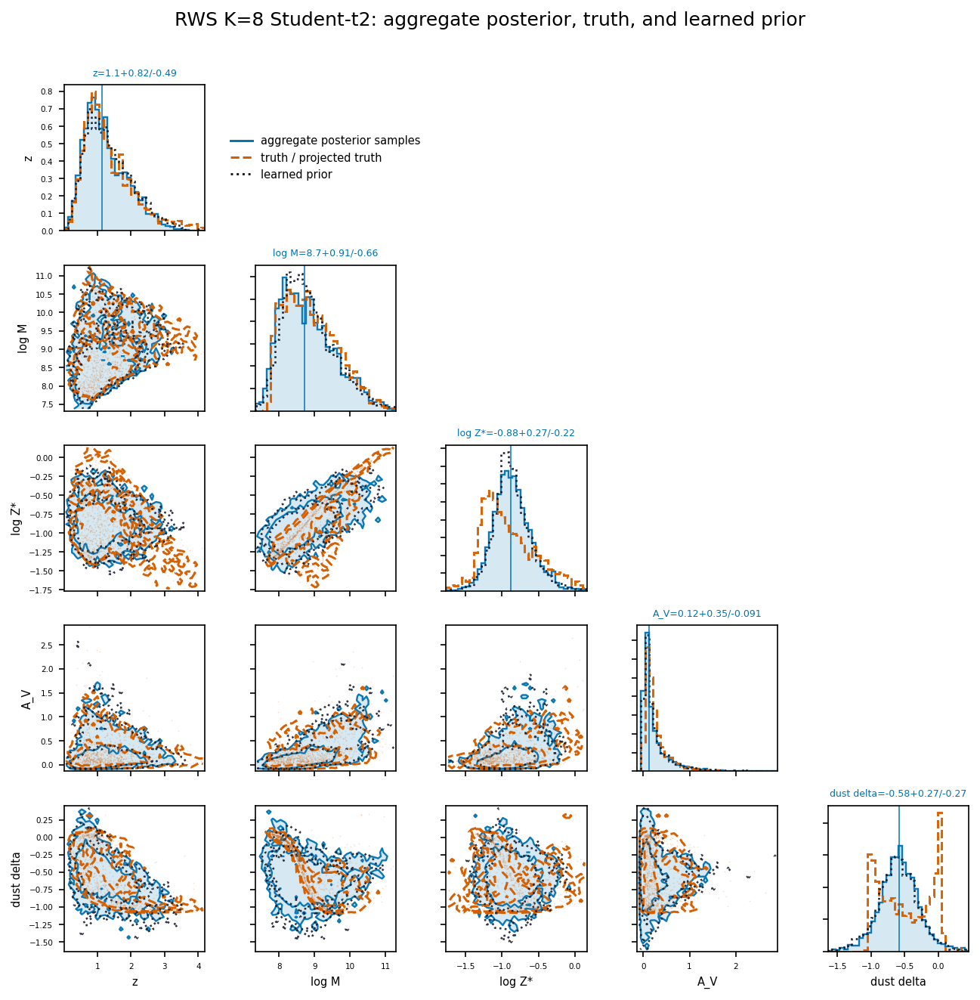
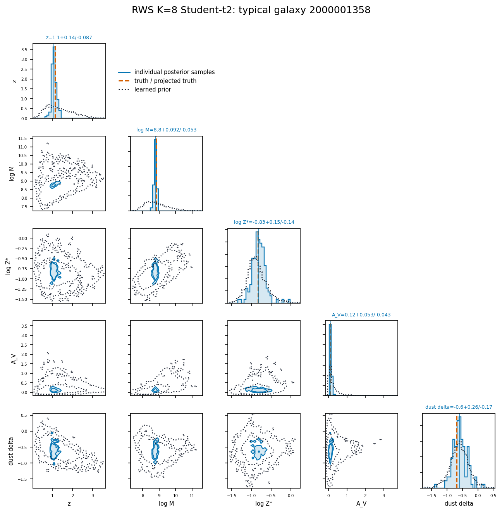
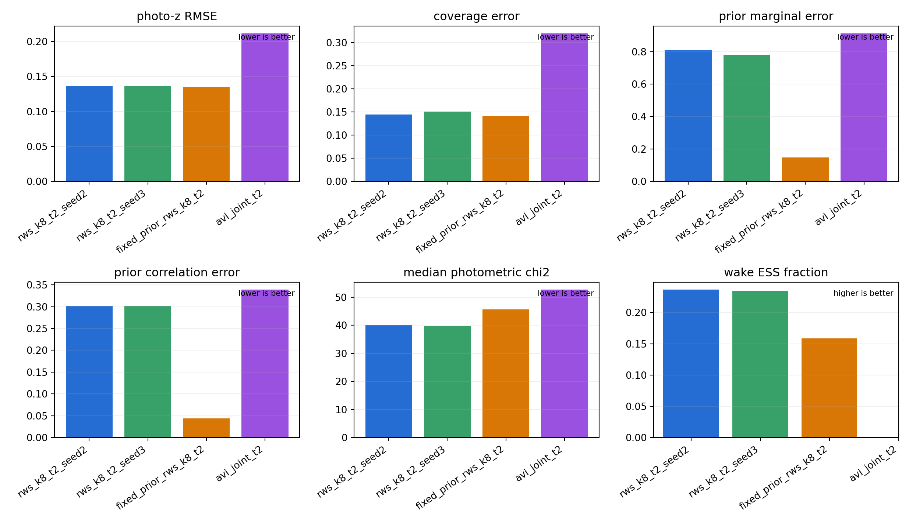
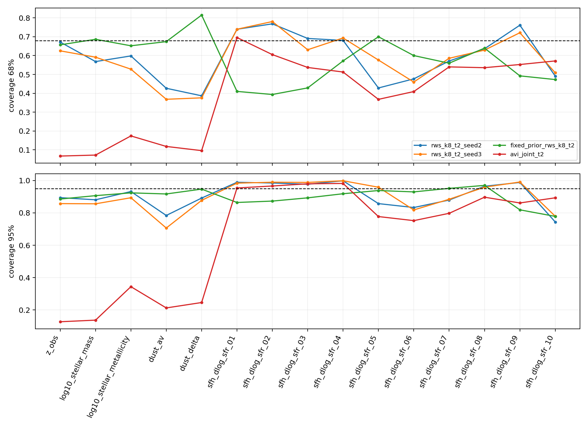
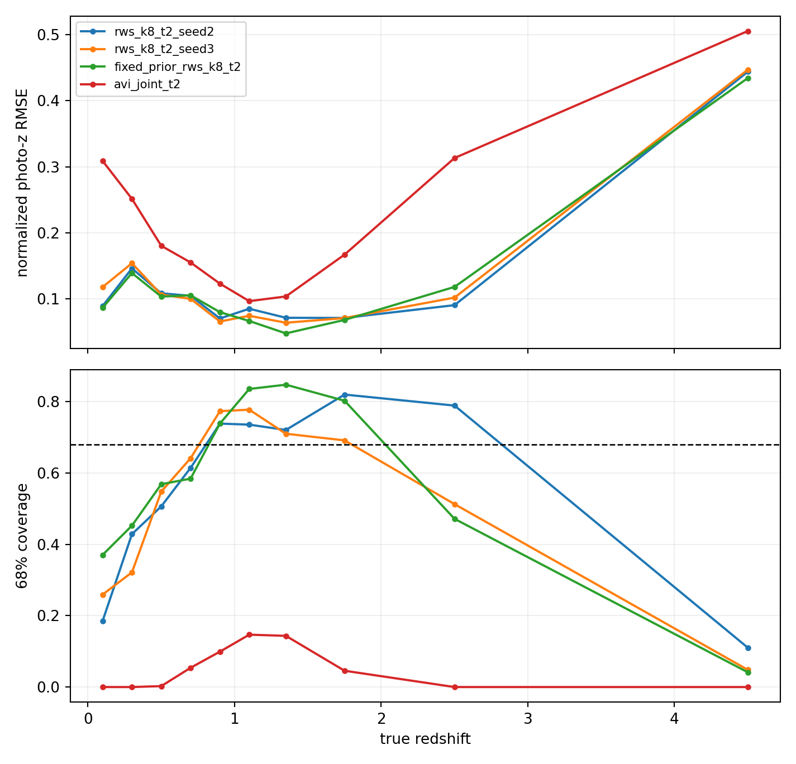
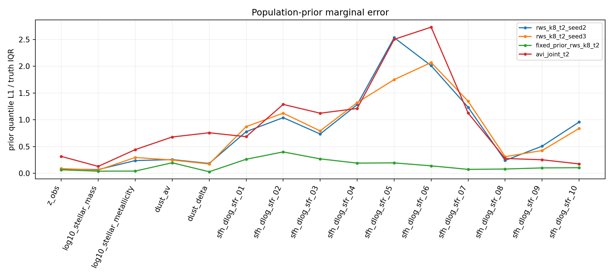
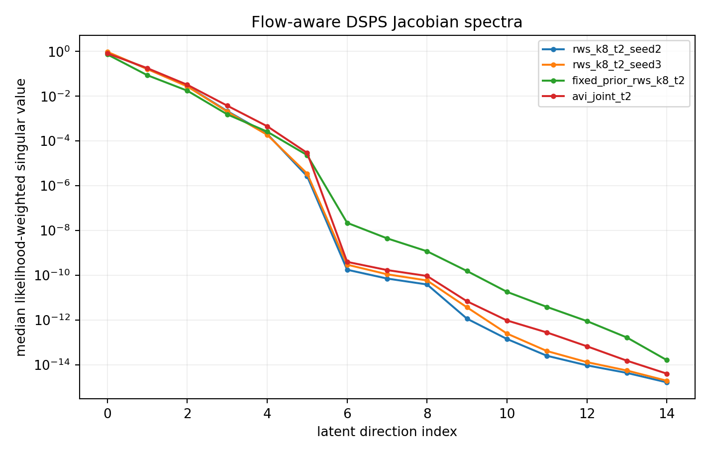
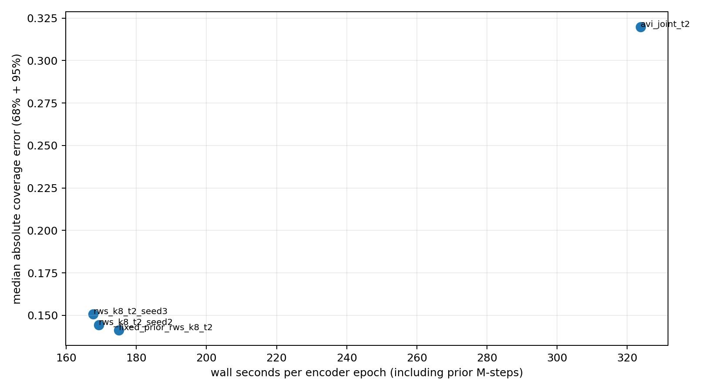
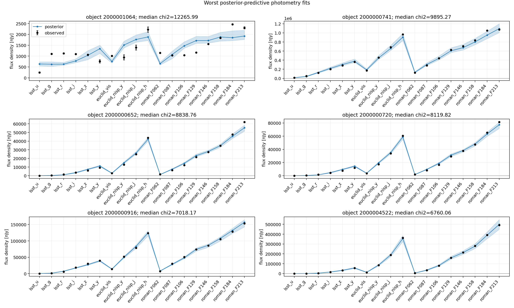

# FENIKS RWS validation evidence

This directory contains the compact evidence bundle used to review the current
FENIKS self-supervised RWS implementation. The figures come from the completed
Jean-Zay paper matrix under:

`outputs/jean_zay_20260724/feniks_selfsup_paper_v1`

The controlled comparison uses the same 15D spline-SFH parameterization,
immutable `mixed_log_shifted_asinh` normalization, DSPS decoder, 18-band
catalog, four-layer conditional RealNVP posterior, and Student-t likelihood
with two degrees of freedom. Truth columns are excluded from optimization and
used only for held-out closure diagnostics.

## Compared runs

| Run | Prior | Objective | Seed |
| --- | --- | --- | --- |
| `rws_k8_t2_seed2` | learned RealNVP | RWS, K=8 | 260723 |
| `rws_k8_t2_seed3` | learned RealNVP | RWS, K=8 | 260724 |
| `fixed_prior_rws_k8_t2` | frozen reference RealNVP | RWS, K=8 | 260725 |
| `avi_joint_t2` | learned RealNVP | stochastic ELBO, reverse KL | 260726 |

All runs use 5,000 held-out objects, 128 posterior samples per object, and
16,384 prior samples. The common normalization hash is
`48fe36f64913880149fde24603d75fb8219659cd8f21598aa7b76cd0a22c5a1b`.

| Run | Seconds / encoder epoch | Wake ESS fraction | Coverage 68 | Coverage 95 | Photo-z RMSE | Median photometric chi2 | Collapse gate |
| --- | ---: | ---: | ---: | ---: | ---: | ---: | --- |
| `rws_k8_t2_seed2` | 169.23 | 0.2365 | 0.5982 | 0.8942 | 0.13654 | 40.18 | FAIL |
| `rws_k8_t2_seed3` | 167.63 | 0.2351 | 0.5914 | 0.8936 | 0.13638 | 39.82 | FAIL |
| `fixed_prior_rws_k8_t2` | 174.97 | 0.1587 | 0.6000 | 0.9170 | 0.13486 | 45.62 | WARN |
| `avi_joint_t2` | 323.89 | n/a | 0.5128 | 0.7974 | 0.21164 | 52.68 | FAIL |

The two learned-prior RWS seeds reproduce each other closely. Relative to
joint AVI, RWS is about twice as fast per encoder epoch and improves posterior
coverage, photo-z RMSE, and posterior-predictive photometry. The learned prior
does not yet match the reference 15D population: both RWS replications still
fail the conservative collapse gate and retain larger marginal and correlation
errors than the frozen reference prior. This bundle therefore validates the
method and its reproducibility, not complete 15D population closure.

## Posterior evidence

### Aggregate posterior

The aggregate plot overlays posterior samples, projected truth, and the learned
prior for the five core physical parameters. It is regenerated from the final
`rws_k8_t2_seed2` posterior shards rather than cropped from the 15D plot.

### Individual posterior

This plot uses catalog row 1358, object `2000001358`, selected as a typical
15D galaxy. It overlays its 128 amortized posterior samples with the object
truth and the learned population prior from the same final seed-2 run.

## Cross-run diagnostics

## Photometric reconstruction

The retained fit panel is generated from posterior-predictive DSPS fluxes for
the seed-2 RWS run and includes the most difficult held-out examples selected
by posterior-predictive chi2.

The complete numerical tables and full 15D corners remain in the run
directory. The CSV files next to the two compact corners record the plotted
columns and finite-row counts.
