Diffsky HLTDS Dataset
=====================

Production status
-----------------

This page documents HLTDS reference and debug datasets. It does not define the
production FENIKS/DSPS closure training contract; use :doc:`production` and
:doc:`diffsky_synthetic_closure` for that path. The HLTDS projected-truth
tables are useful for reconstruction diagnostics and low-redshift reference
comparisons, but projected PopCosmos bins must not be presented as direct
object-level ground truth.

Dataset Choice
--------------

Six local HLTDS Diffsky artifacts are useful for the current validation
program. They should not be treated as interchangeable because they cover
different redshift ranges and have different error semantics.

.. list-table::
   :header-rows: 1

   * - Dataset
     - Local processed parquet
     - Objects / shards
     - Redshift range
     - Recommended role
   * - ``hltds_cosmos_260215_04_14_2026_continuous_lowz_projected_truth``
     - ``Data/diffsky/processed/hltds_cosmos_260215_04_14_2026_continuous_lowz_fluxerr_projected_truth.parquet``
     - ``78651`` objects from the 04/14 ``m5_depth`` prepared source
     - ``z = 0.0069 -- 0.3347``; median ``z = 0.250``
     - Default HLTDS reconstruction/debug, no-KL autoencoder, MAP, inference,
       and supervisor notebook dataset. It contains the materialized
       ``fluxerr_*`` error model plus DSPS projected-truth columns.
   * - ``hltds_cosmos_260215_04_14_2026_continuous_lowz_fluxerr``
     - ``Data/diffsky/processed/hltds_cosmos_260215_04_14_2026_continuous_lowz_fluxerr.parquet``
     - ``78651`` objects from the 04/14 ``m5_depth`` prepared source
     - ``z = 0.0069 -- 0.3347``; median ``z = 0.250``
     - Intermediate low-z subset with flux errors before DSPS projected-truth
       columns are added. Do not use it as the default modeling dataset.
   * - ``hltds_cosmos_260215_04_14_2026_source_m5depth``
     - ``Data/diffsky/processed/hltds_cosmos_260215_04_14_2026_photometry_truth_m5depth.parquet``
     - ``369264`` objects across 16 source files
     - ``z = 0.007 -- 1.006``; median ``z = 0.693``
     - Full source artifact with the current synthetic ``fluxerr_*`` contract.
   * - ``hltds_cosmos_260215_04_14_2026_source_noerr``
     - ``Data/diffsky/processed/hltds_cosmos_260215_04_14_2026_photometry_truth_noerr.parquet``
     - about 369k objects across 16 source files
     - ``z = 0.007 -- 1.006``; median ``z = 0.693``
     - Historical source artifact without ``fluxerr_*`` columns.
   * - ``hltds_cosmos_260215_03_31_2026_zmax335_m5depth``
     - ``Data/diffsky/processed/hltds_cosmos_260215_03_31_2026_zmax335_m5depth.parquet``
     - ``493903`` objects from the 03/31 source
     - requested cut ``0 <= z <= 3.35``; current local source has
       ``z = 1.055 -- 3.032``; median ``z = 2.429``
     - Canonical truth-rich dataset for truth/prior/projection work. It keeps
       the 03/31 truth/generated-truth columns and materializes the current
       ``m5_depth`` ``fluxerr_*`` contract.
   * - ``hltds_cosmos_260215_03_31_2026``
     - ``Data/diffsky/processed/hltds_cosmos_260215_03_31_2026_photometry_truth.parquet``
     - about 494k objects across 6 source files
     - ``z = 1.055 -- 3.032``; median ``z = 2.429``
     - Historical high-redshift prepared source. It contains truth and
       generated-truth columns, but its original manifest records a legacy
       ``synthetic_fractional_snr`` error model, so prefer the ``zmax335``
       ``m5_depth`` derivative above for current science comparisons.

The continuous low-z projected-truth ``04_14`` subset is the current fast HLTDS
public config target for reconstruction debugging. Its redshift distribution is
continuous and easier to learn than the multi-clump full 04/14 source
distribution, and the subset materializes both the explicit ``fluxerr_*`` error
model used by the likelihood and the DSPS projected-truth columns used by
diagnostics and the supervisor notebook. The full ``04_14`` ``m5_depth``
parquet is the source artifact for rebuilding low-z subsets.

For truth/prior/projection work, use
``hltds_cosmos_260215_03_31_2026_zmax335_m5depth`` as the canonical
truth-rich dataset. It is the requested ``z <= 3.35`` subset with the current
``m5_depth`` error model. The current local 03/31 source only reaches
``z = 3.0319715``, so the ``3.35`` cut intentionally keeps the whole local
high-redshift source while making the intended upper bound explicit.

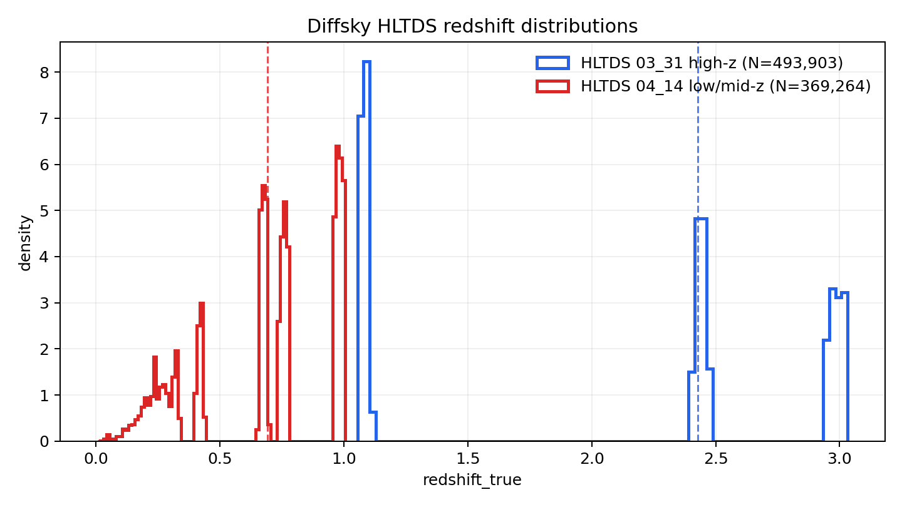

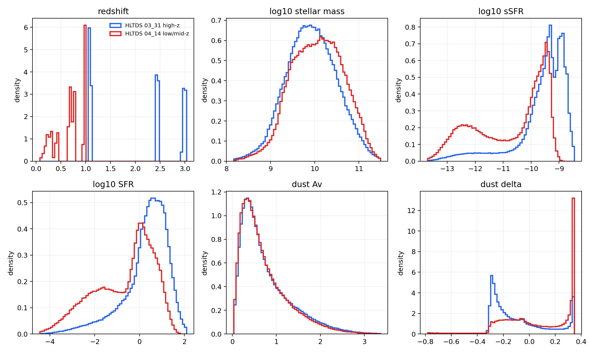

Truth/parameter ranges for the two main source families:

.. list-table::
   :header-rows: 1

   * - Dataset
     - Quantity
     - 5%
     - Median
     - 95%
   * - ``03_31``
     - ``redshift_true``
     - ``1.062``
     - ``2.429``
     - ``3.017``
   * - ``04_14``
     - ``redshift_true``
     - ``0.201``
     - ``0.693``
     - ``0.997``
   * - ``03_31``
     - ``logsm_true``
     - ``8.992``
     - ``9.917``
     - ``10.881``
   * - ``04_14``
     - ``logsm_true``
     - ``9.115``
     - ``10.069``
     - ``10.998``
   * - ``03_31``
     - ``logssfr_true``
     - ``-12.025``
     - ``-9.386``
     - ``-8.693``
   * - ``04_14``
     - ``logssfr_true``
     - ``-12.969``
     - ``-10.232``
     - ``-9.312``
   * - ``03_31``
     - ``logsfr_true``
     - ``-1.925``
     - ``0.490``
     - ``1.540``
   * - ``04_14``
     - ``logsfr_true``
     - ``-3.198``
     - ``-0.293``
     - ``1.046``
   * - ``03_31``
     - ``dust_av``
     - ``0.148``
     - ``0.590``
     - ``1.978``
   * - ``04_14``
     - ``dust_av``
     - ``0.134``
     - ``0.570``
     - ``1.858``
   * - ``03_31``
     - ``dust_delta``
     - ``-0.305``
     - ``-0.172``
     - ``0.337``
   * - ``04_14``
     - ``dust_delta``
     - ``-0.306``
     - ``0.052``
     - ``0.344``

Both HLTDS versions expose the core truth columns used by the pipeline
(``redshift_true``, ``logsm_true``, ``logssfr_true``, ``logsfr_true``) and the
same generated-truth families used by the extended prior and true-parameter
closure diagnostics: ``diffstar_*``, ``diffmah_*``, ``dust_*``, and
``burst_*``.

Canonical Truth-Rich Dataset
----------------------------

The canonical dataset for truth/prior/projection work is:

.. code-block:: text

   Data/diffsky/processed/hltds_cosmos_260215_03_31_2026_zmax335_m5depth.parquet

It is built from the 03/31 high-redshift prepared source with the current
``m5_depth`` ``fluxerr_*`` contract:

.. code-block:: bash

   python -m euclid_dsps.cli diffsky-redshift-subset \
     --dataset Data/diffsky/processed/hltds_cosmos_260215_03_31_2026_photometry_truth.parquet \
     --out Data/diffsky/processed/hltds_cosmos_260215_03_31_2026_zmax335_m5depth.parquet \
     --redshift-min 0.0 \
     --redshift-max 3.35 \
     --error-model m5_depth

The current local build writes ``493903`` objects. The requested redshift cut is
``0 <= z <= 3.35``; the actual local 03/31 source spans
``z = 1.0552149 -- 3.0319715`` with median ``z = 2.4286592``. The output has 14
``flux_*`` columns, 14 ``fluxerr_*`` columns, direct truth columns including
``redshift_true``, ``logsm_true``, ``logsfr_true``, and ``logssfr_true``, and
generated-truth columns including ``diffstar_*``, ``diffmah_*``, ``dust_av``,
``dust_delta``, and ``burst_*``.

Companion files are generated next to the parquet:

.. code-block:: text

   Data/diffsky/processed/hltds_cosmos_260215_03_31_2026_zmax335_m5depth.manifest.yaml
   Data/diffsky/processed/hltds_cosmos_260215_03_31_2026_zmax335_m5depth.schema.json
   Data/diffsky/processed/hltds_cosmos_260215_03_31_2026_zmax335_m5depth.summary.json
   Data/diffsky/processed/hltds_cosmos_260215_03_31_2026_zmax335_m5depth.truth_summary.csv
   Data/diffsky/processed/hltds_cosmos_260215_03_31_2026_zmax335_m5depth.truth_report.md
   Data/diffsky/processed/hltds_cosmos_260215_03_31_2026_zmax335_m5depth.report.md
   Data/diffsky/processed/hltds_cosmos_260215_03_31_2026_zmax335_m5depth/redshift_true_distribution.png
   Data/diffsky/processed/hltds_cosmos_260215_03_31_2026_zmax335_m5depth/truth_distributions.png
   Data/diffsky/processed/hltds_cosmos_260215_03_31_2026_zmax335_m5depth/flux_fractional_error_by_band.png
   Data/diffsky/processed/hltds_cosmos_260215_03_31_2026_zmax335_m5depth/flux_snr_by_band.png
   Data/diffsky/processed/hltds_cosmos_260215_03_31_2026_zmax335_m5depth/flux_vs_fluxerr_by_band.png

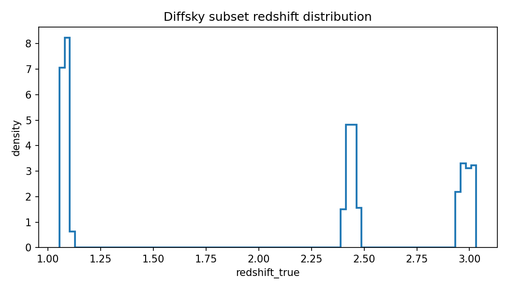

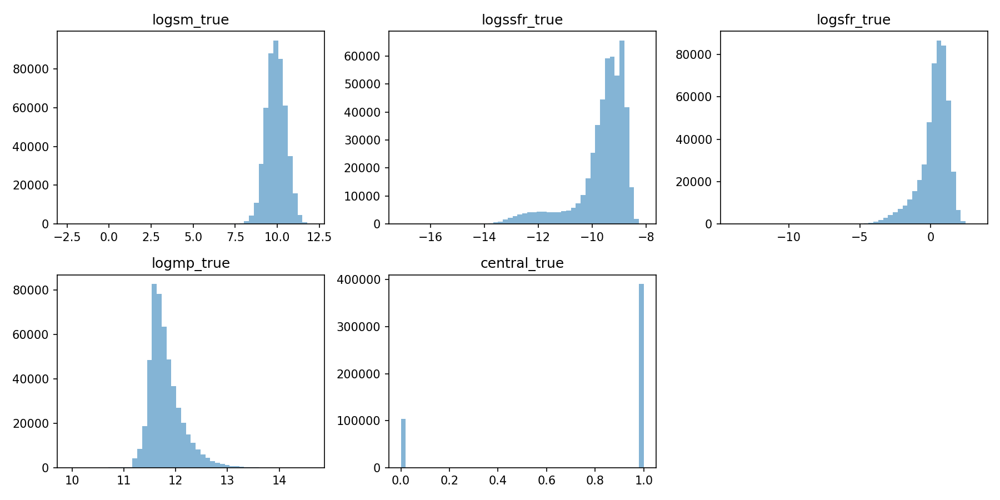

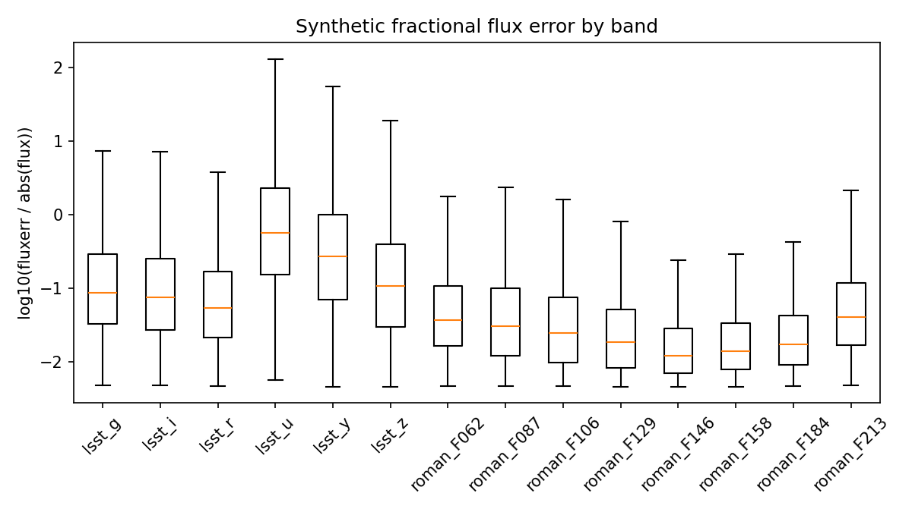

Use this dataset when a workflow needs generated truth as the reference
population. Use the low-z ``04_14`` subset when the goal is a smaller,
continuous-redshift reconstruction smoke/debug run.

MCLMC Projected Truth Distributions
-----------------------------------

The MCLMC comparison dashboard writes an explicit projected-truth table next to
the corner plots:

.. code-block:: text

   outputs/comparison/diffsky_reconstruction_debug/plots/mclmc/worst100_b32_w64_s256/mclmc_projected_truth_parameters.csv
   outputs/comparison/diffsky_reconstruction_debug/plots/mclmc/worst100_b32_w64_s256/mclmc_projected_truth_metadata.csv

The distribution plot below is generated from that table. It is the reference
for checking whether a missing orange overlay in a posterior plot is a plotting
problem or a truly unavailable parameter.

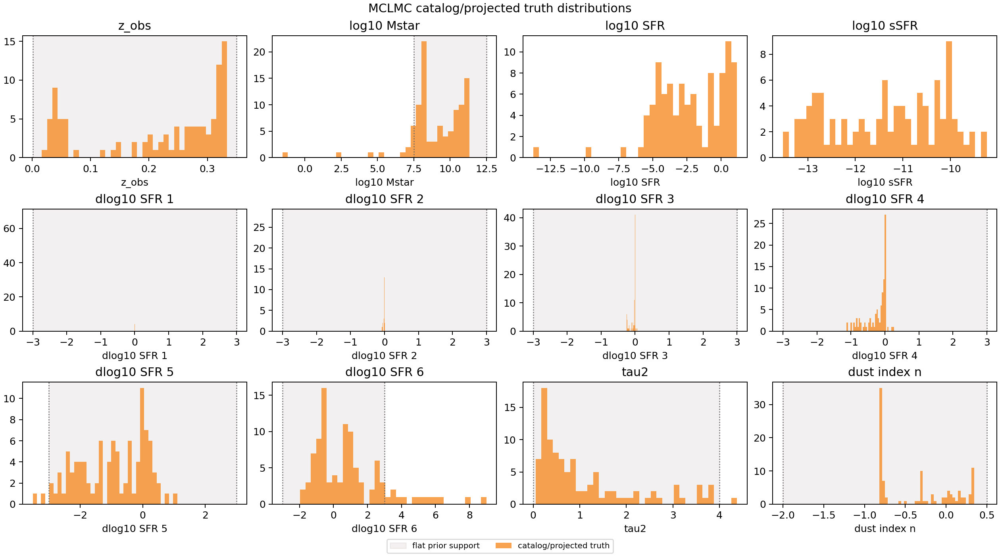

The table contains three kinds of quantities:

.. list-table::
   :header-rows: 1

   * - MCLMC/diagnostic quantity
     - Source
     - Formula or projection
   * - ``z_obs``
     - direct catalog truth
     - ``z_obs = redshift_true``
   * - ``log10_stellar_mass``
     - direct catalog truth
     - ``log10_stellar_mass = logsm_true``
   * - ``log10_sfr_at_obs``
     - direct catalog truth
     - ``log10_sfr_at_obs = logsfr_true``
   * - ``log10_ssfr_at_obs``
     - direct catalog truth
     - ``log10_ssfr_at_obs = logssfr_true`` when present, otherwise
       ``logsfr_true - logsm_true``
   * - ``dlog10_sfr_1`` ... ``dlog10_sfr_6``
     - projected generated truth
     - Diffstar/Diffmah generated SFH projected through
       ``project_sfh_to_popcosmos_dlogsfr_jax``
   * - ``tau2``
     - projected generated truth
     - ``tau2 = dust_av / 1.086``
   * - ``dust_index_n``
     - projected generated truth
     - ``dust_index_n = dust_delta``
   * - ``log10_stellar_metallicity``
     - missing truth
     - no object-level stellar-metallicity truth column in the active parquet
   * - ``tau1_over_tau2``
     - missing truth
     - no object-level birth-cloud dust-ratio truth column in the active
       parquet

Exact Projection Method
~~~~~~~~~~~~~~~~~~~~~~~

The projected-truth table is generated from the MCLMC run's
``normalized_config.json``. The dashboard reads the configured ``catalog_path``,
selects the exact ``row_index`` values present in
``batch_posterior_summary.csv``, and then computes one truth row per MCLMC
object.

Direct catalog quantities are simple column mappings:

.. code-block:: text

   z_obs                  = redshift_true
   log10_stellar_mass    = logsm_true
   log10_sfr_at_obs      = logsfr_true
   log10_ssfr_at_obs     = logssfr_true

If ``logssfr_true`` is absent but ``logsfr_true`` and ``logsm_true`` are
present, the fallback direct derivation is:

.. math::

   \log_{10}\mathrm{sSFR}_{\mathrm{obs}} =
   \log_{10}\mathrm{SFR}_{\mathrm{obs}} - \log_{10}M_\star

The six ``dlog10_sfr_*`` quantities are not read directly from the catalog.
They are projected from the generated Diffstar/Diffmah SFH latents:
``diffstar_lgmcrit``, ``diffstar_lgy_at_mcrit``, ``diffstar_indx_lo``,
``diffstar_indx_hi``, ``diffstar_lg_qt``, ``diffstar_qlglgdt``,
``diffstar_lg_drop``, ``diffstar_lg_rejuv``, ``diffmah_logm0``,
``diffmah_logtc``, ``diffmah_early_index``, ``diffmah_late_index``, and
``diffmah_t_peak``.

For each object:

1. Compute the cosmic age at the catalog truth redshift with the DSPS default
   cosmology:

   .. math::

      t_{\mathrm{obs}} = \mathrm{age\_at\_z}(\mathrm{redshift\_true})

2. Build the SFH evaluation grid used by the active run:

   .. math::

      t_k = \mathrm{linspace}(0.05,\ \max(t_{\mathrm{obs}}, 0.06),\ n_{\mathrm{sfh}})

   where ``n_sfh`` comes from ``model.n_sfh_bins`` in the normalized config
   and is ``80`` for the current MCLMC run.

3. Evaluate the generated Diffstar/Diffmah SFH with
   ``build_diffsky_basic_sfh_table_jax``:

   .. math::

      \mathrm{SFR}(t_k) =
      \mathrm{Diffstar}(\mathrm{diffstar\ params},\ \mathrm{diffmah\ params},\ t_k)

   The implementation clips the returned SFH to be finite and positive, with a
   minimum of ``1e-14``.

4. Build the seven PopCosmos lookback bins with
   ``build_popcosmos_lookback_bin_edges_jax``. For normal object ages, the
   lookback edges are:

   .. code-block:: text

      [0, 0.03, logspace(0.10, 0.85*t_obs, 5), t_obs]

   If ``t_obs <= 0.13`` Gyr, the code uses fixed fractions of ``t_obs``:

   .. code-block:: text

      t_obs * [0, 0.03, 0.10, 0.20, 0.35, 0.55, 0.85, 1.0]

5. Integrate the generated SFH into each lookback bin with the same projection
   as ``project_sfh_to_popcosmos_sfr_bins_jax``. For bin ``j`` with cosmic-time
   interval ``[t_{\mathrm{low},j}, t_{\mathrm{high},j}]``:

   .. math::

      \langle \mathrm{SFR} \rangle_j =
      \frac{
      \int_{t_{\mathrm{low},j}}^{t_{\mathrm{high},j}}
      \mathrm{SFR}(t)\,dt
      }{
      t_{\mathrm{high},j} - t_{\mathrm{low},j}
      }

   Numerically, the cumulative formed mass is computed by trapezoidal
   integration on ``t_k`` and interpolated at the bin edges.

6. Convert the seven bin-average SFRs into the six PopCosmos adjacent log
   ratios with ``project_sfh_to_popcosmos_dlogsfr_jax``:

   .. math::

      \mathrm{dlog10\_sfr}_{j+1} =
      \log_{10}\left(\max(\langle\mathrm{SFR}\rangle_j, 10^{-30})\right) -
      \log_{10}\left(\max(\langle\mathrm{SFR}\rangle_{j+1}, 10^{-30})\right)

   for ``j = 0..5``. The order is youngest to oldest lookback bin, so
   ``dlog10_sfr_1`` compares the youngest bin to the next-youngest bin.

The dust projection matches ``diffsky_basic_dust_params_jax``:

.. math::

   \tau_2 = \max\left(\frac{\mathrm{dust\_av}}{1.086}, 0\right)

.. math::

   \mathrm{dust\_index\_n} = \mathrm{dust\_delta}

The current parquet does not include an object-level birth-cloud dust-ratio
truth, so ``tau1_over_tau2`` remains unavailable. Likewise, it does not include
an object-level stellar-metallicity truth column, so
``log10_stellar_metallicity`` remains unavailable.

The dashboard keeps a fallback constant-slope proxy from ``logssfr_true`` only
for environments where the exact Diffstar/Diffmah/JAX projection cannot run.
The regenerated MCLMC dashboard artifacts in this repository were produced in
the ``shine`` environment with the exact Diffstar/Diffmah projection path
available, so their metadata marks ``dlog10_sfr_1`` ... ``dlog10_sfr_6`` as
``projected_generated_truth`` rather than ``truth_proxy``.

The MCLMC posterior-coordinate plots therefore have truth overlays for every
available fitted coordinate in this set: ``z_obs``,
``log10_stellar_mass``, all six ``dlog10_sfr_*`` coordinates, ``tau2``, and
``dust_index_n``. They intentionally do not show truth overlays for
``log10_stellar_metallicity`` or ``tau1_over_tau2`` until those quantities are
added to the generated catalog with object-level truth semantics.

Important caveat: the continuous low-z ``04_14`` subset uses synthetic
``m5_depth`` ``fluxerr_*`` columns. Those errors are not native observational
errors from HLTDS. They are explicit likelihood assumptions, materialized in
the parquet, and recorded in the dataset manifest/schema. The older
``fractional_snr`` label only describes legacy/test artifacts.

The current fast reconstruction/debug dataset is:

.. code-block:: text

   hltds_cosmos_260215_04_14_2026_continuous_lowz

from:

.. code-block:: text

   https://portal.nersc.gov/cfs/hacc/aphearin/diffsky_data/hltds_cosmos_260215_04_14_2026/

The truth-rich reference dataset for generated-truth population work is instead:

.. code-block:: text

   hltds_cosmos_260215_03_31_2026_zmax335_m5depth

Both are preferred over the public OpenUniverse SkyCatalog parquet pair for the
current project because they expose cleaner local HDF5 samples with photometry,
direct truth, and generated-truth columns in the same investigation workflow.
OpenUniverse tooling can remain in the package, but it is not the public
end-to-end path documented here.

Processed File
--------------

The normalized file used by the fast public Diffsky reconstruction configs is
the continuous low-z subset with materialized flux errors and DSPS
projected-truth columns:

.. code-block:: text

   Data/diffsky/processed/hltds_cosmos_260215_04_14_2026_continuous_lowz_fluxerr_projected_truth.parquet

First rebuild the low-z flux-error intermediate from the full prepared 04/14
source parquet:

.. code-block:: bash

   python -m euclid_dsps.cli diffsky-redshift-subset \
     --dataset Data/diffsky/processed/hltds_cosmos_260215_04_14_2026_photometry_truth_m5depth.parquet \
     --out Data/diffsky/processed/hltds_cosmos_260215_04_14_2026_continuous_lowz_fluxerr.parquet \
     --redshift-min 0.0 \
     --redshift-max 0.35 \
     --error-model m5_depth

Then materialize the DSPS projected-truth columns outside any notebook:

.. code-block:: bash

   conda activate shine
   python scripts/build_diffsky_lowz_projected_truth_dataset.py --force

This final parquet keeps the 78651 rows from the low-z flux-error subset and
adds ``row_index``, ``z_obs``, ``log10_stellar_mass``,
``log10_sfr_at_obs``, ``log10_ssfr_at_obs``, ``dlog10_sfr_1`` through
``dlog10_sfr_6``, ``projected_log10_sfr_bin_1`` through
``projected_log10_sfr_bin_7``, ``tau2``, ``dust_index_n``,
``log10_stellar_metallicity``, ``tau1_over_tau2``, and
``projected_truth_available``. The metallicity and birth-cloud ratio columns
are present but all-NaN because the active low-z Diffsky parquet has no
object-level truth for them.

The script also writes
``hltds_cosmos_260215_04_14_2026_continuous_lowz_fluxerr_projected_truth.sfr_consistency.csv``.
This table compares catalog ``logsfr_true`` and ``logssfr_true`` against each
projected PopCosmos SFR bin. The youngest projected bin is a lookback-bin
average, so it is a diagnostic of convention consistency rather than a
requirement that it be identical to instantaneous ``logsfr_true``.

The reference no-KL train/validation subset supplied to supervisors is:

.. code-block:: text

   Data/diffsky/processed/hltds_cosmos_260215_04_14_2026_continuous_lowz_fluxerr_projected_truth_nokl_trainval20k.parquet

It contains the exact 20000 rows selected by
``outputs/runs/diffsky_autoencoder_nokl_m5sys_z035_rand20k_e30_b128``:
17999 training rows followed by 2001 validation rows, with ``nokl_split`` and
``reference_subset_order`` columns.

The companion files for the low-z flux-error intermediate and projected-truth
dataset are:

.. code-block:: text

   Data/diffsky/processed/hltds_cosmos_260215_04_14_2026_continuous_lowz_fluxerr.manifest.yaml
   Data/diffsky/processed/hltds_cosmos_260215_04_14_2026_continuous_lowz_fluxerr.schema.json
   Data/diffsky/processed/hltds_cosmos_260215_04_14_2026_continuous_lowz_fluxerr.summary.json
   Data/diffsky/processed/hltds_cosmos_260215_04_14_2026_continuous_lowz_fluxerr.truth_summary.csv
   Data/diffsky/processed/hltds_cosmos_260215_04_14_2026_continuous_lowz_fluxerr.truth_report.md
   Data/diffsky/processed/hltds_cosmos_260215_04_14_2026_continuous_lowz_fluxerr.report.md
   Data/diffsky/processed/hltds_cosmos_260215_04_14_2026_continuous_lowz_fluxerr/flux_error_summary.csv
   Data/diffsky/processed/hltds_cosmos_260215_04_14_2026_continuous_lowz_fluxerr/redshift_true_distribution.png
   Data/diffsky/processed/hltds_cosmos_260215_04_14_2026_continuous_lowz_fluxerr/truth_distributions.png
   Data/diffsky/processed/hltds_cosmos_260215_04_14_2026_continuous_lowz_fluxerr/flux_fractional_error_by_band.png
   Data/diffsky/processed/hltds_cosmos_260215_04_14_2026_continuous_lowz_fluxerr/flux_snr_by_band.png
   Data/diffsky/processed/hltds_cosmos_260215_04_14_2026_continuous_lowz_fluxerr/flux_vs_fluxerr_by_band.png
   Data/diffsky/processed/hltds_cosmos_260215_04_14_2026_continuous_lowz_fluxerr/flux_error_model_curves_by_band.png
   Data/diffsky/processed/hltds_cosmos_260215_04_14_2026_continuous_lowz_fluxerr/flux_fractional_error_model_curves_by_band.png
   Data/diffsky/processed/hltds_cosmos_260215_04_14_2026_continuous_lowz_fluxerr_projected_truth.summary.json
   Data/diffsky/processed/hltds_cosmos_260215_04_14_2026_continuous_lowz_fluxerr_projected_truth.projected_truth_metadata.csv
   Data/diffsky/processed/hltds_cosmos_260215_04_14_2026_continuous_lowz_fluxerr_projected_truth_nokl_trainval20k.summary.json

The rebuilt subset should show no separated ``z~0.4`` island:

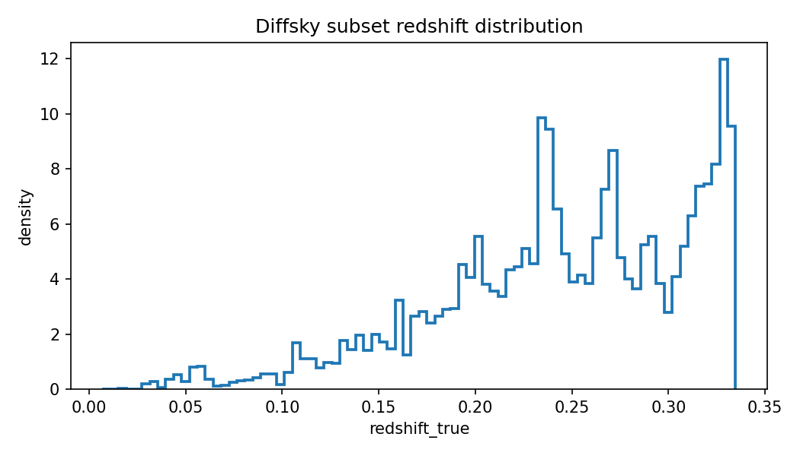

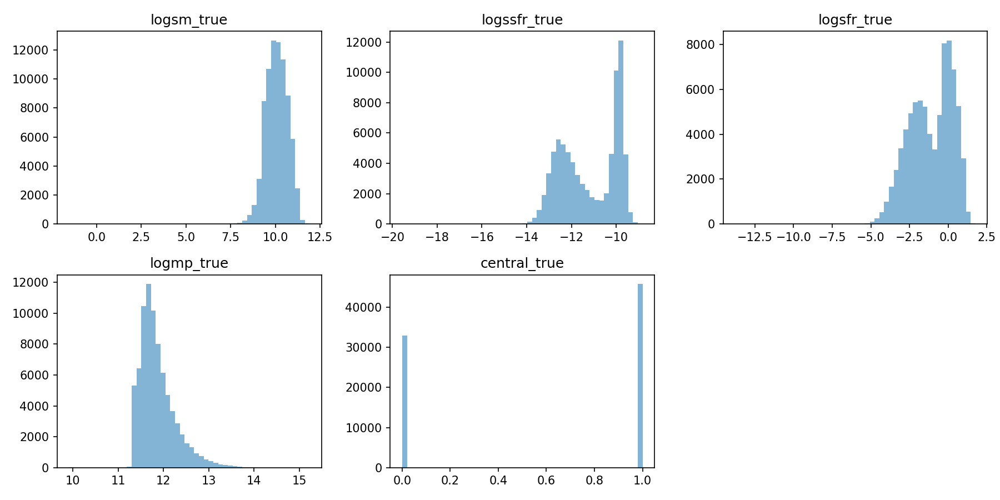

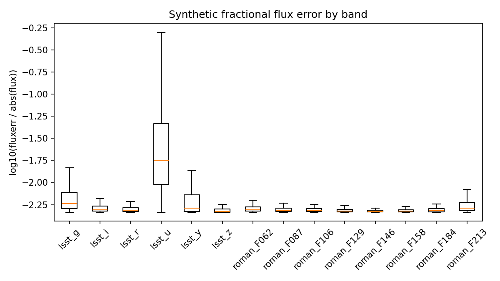

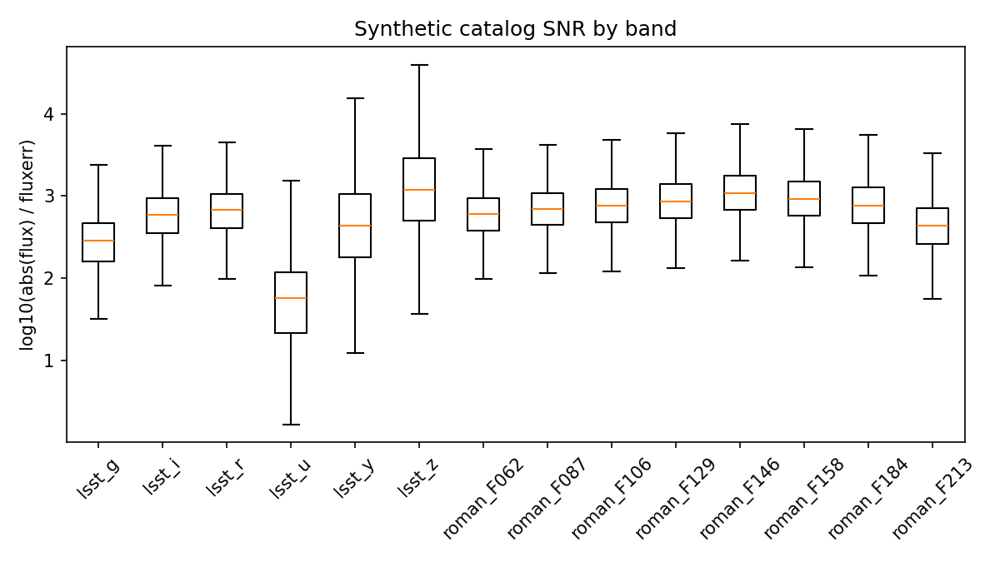

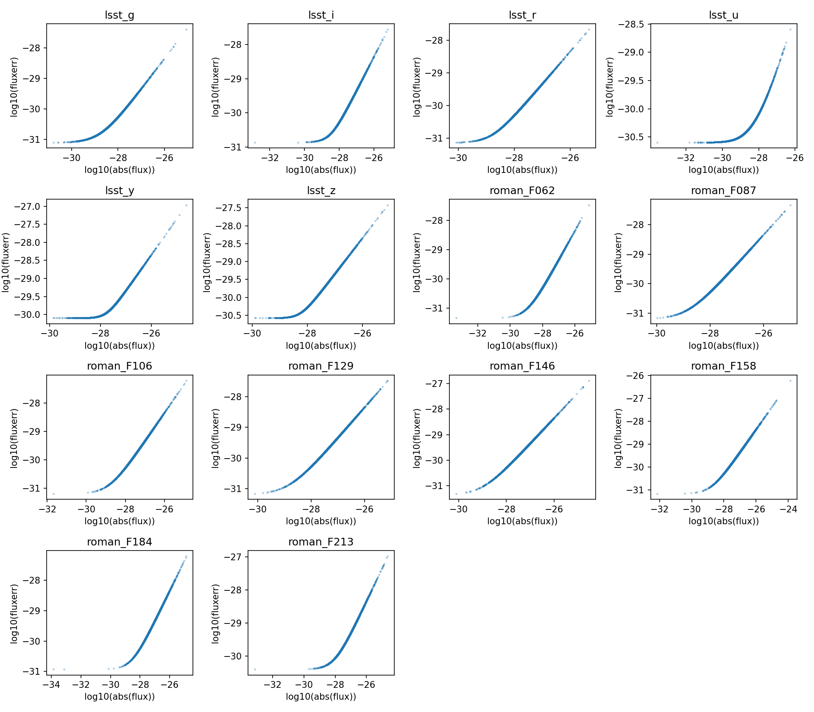

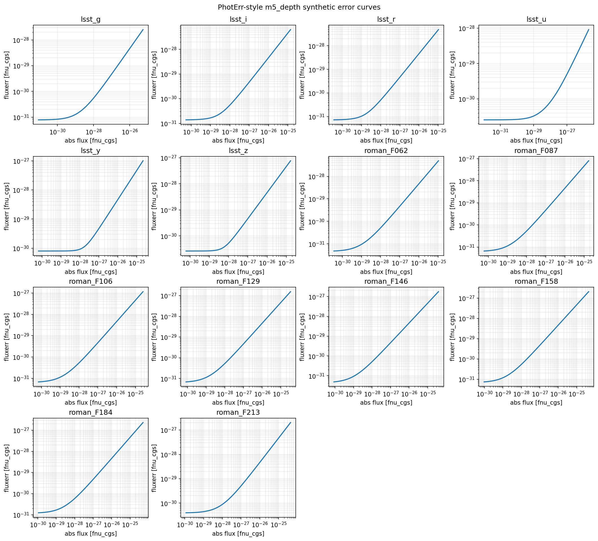

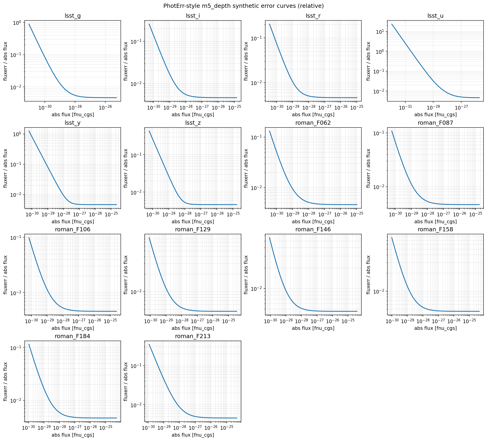

On Jean-Zay, the H100 Slurm scripts call the same
``diffsky-redshift-subset`` command automatically if the flux-error
intermediate is missing and the full ``*_photometry_truth_m5depth.parquet``
source exists. The projected-truth parquet is the default modeling path; if it
is missing, run ``scripts/build_diffsky_lowz_projected_truth_dataset.py`` after
the flux-error intermediate has been rebuilt.

Integrity Contract
------------------

Prepared datasets preserve the native ``core_tag`` column when it is present.
``object_id`` is guaranteed unique in the prepared parquet. If ``core_tag`` is
globally unique across all processed shards, ``object_id`` equals
``core_tag``. If duplicate ``core_tag`` values are detected across shards, the
preparer adds:

.. code-block:: text

   global_object_id
   source_file
   source_row

and sets ``object_id`` to ``global_object_id``. The manifest records
``object_id.strategy``, ``core_tag_unique_global``, and ``object_id_unique`` so
downstream reports do not silently treat duplicated source ids as unique
objects.

The schema JSON and manifest classify every prepared column into:

.. code-block:: text

   truth
   generated_truth
   derived_truth
   diagnostic
   proxy
   unavailable

This classification is also written to the truth report and the integrity
report. Diffstar, Diffmah, dust, and burst latent exports are
``generated_truth``: they are simulator parameters, not recovered quantities
from a photometric fit.

Photometry Contract
-------------------

The public Diffsky configs use 14 LSST+Roman bands:

.. code-block:: text

   lsst_u
   lsst_g
   lsst_r
   lsst_i
   lsst_z
   lsst_y
   roman_F062
   roman_F087
   roman_F106
   roman_F129
   roman_F146
   roman_F158
   roman_F184
   roman_F213

The prepared source parquet keeps magnitude columns named ``mag_<band>`` and
flux-density columns named ``flux_<band>``. The main continuous low-z subset
uses the flux-density columns and writes ``fluxerr_<band>`` columns in
``fnu_cgs``:

.. code-block:: yaml

   bands: diffsky_hltds_lsst_roman_14_fnu_cgs
   fit:
     likelihood_space: flux
     photometric_likelihood: student_t
     student_t_dof: 2.0
     flux_error_floor_frac: 0.02

Native photometric error columns were not confirmed in the downloaded sample.
The adopted error model is therefore synthetic, deterministic, and
flux-dependent. No random noise draw is added during dataset preparation, MAP,
MCMC, or amortized inference. The same input flux always gives the same
``fluxerr_*`` value.

There are three separate quantities that should not be confused:

.. list-table::
   :header-rows: 1

   * - Quantity
     - Where it appears
     - Meaning
   * - ``flux_<band>``
     - Parquet input column
     - HLTDS AB magnitude converted to flux density in ``fnu_cgs``.
   * - ``fluxerr_<band>``
     - Parquet input column
     - Synthetic catalog uncertainty from the ``m5_depth``/PhotErr-style
       formula below.
   * - ``sigma_eff``
     - Fit, MCMC, and posterior-predictive diagnostics
     - Likelihood uncertainty after adding the separate DSPS 2% model/floor
       term and optional jitter in quadrature.

``m5_depth`` / ``photo_err`` / PhotErr-Style Formula
~~~~~~~~~~~~~~~~~~~~~~~~~~~~~~~~~~~~~~~~~~~~~~~~~~~~

The ``m5_depth`` error model mirrors the Rubin/LSST ``m5,gamma`` point-source
form used by PhotErr, rewritten directly in flux space. This is the
``photo_err`` formula referred to in the debugging notes, not a native HLTDS
error column. The implementation is
in ``euclid_dsps/photometric_uncertainty.py``. For object ``i`` and band ``b``,
the configured 5-sigma limiting magnitude ``m5_b`` is first converted to a
flux density:

.. math::

   f_{5,b} = f_\nu(m_{5,b})

The random flux variance is:

.. math::

   \sigma_{\mathrm{rand}, i b}^2 =
   (0.04-\gamma_b)\,|f_{i b}|\,f_{5,b}
   + \gamma_b\,f_{5,b}^2

The terms have a direct interpretation:

.. list-table::
   :header-rows: 1

   * - Term
     - Interpretation
   * - ``gamma_b * f5_b^2``
     - Background/depth term. It remains finite even when the catalog flux is
       almost zero.
   * - ``(0.04 - gamma_b) * abs(f_ib) * f5_b``
     - Source/Poisson-like term. It grows with flux.
   * - ``0.04``
     - Sets ``sigma_rand = f5 / 5`` when ``abs(f) = f5``, consistent with
       ``m5`` being a 5-sigma depth.

Following the PhotErr convention, the materialized catalog error also includes
an irreducible systematic term in flux space:

.. math::

   \mathrm{sys\_frac} =
   10^{\sigma_{\mathrm{sys,mag}} / 2.5} - 1

.. math::

   \sigma_{\mathrm{cat}, i b}^2 =
   \sigma_{\mathrm{rand}, i b}^2 +
   \left(\mathrm{sys\_frac}\,|f_{i b}|\right)^2

The current default is ``sigma_sys_mag = 0.005``, i.e. a relative floor of
about ``0.46%`` in the materialized ``fluxerr_*`` columns.

The final parquet column is:

.. math::

   \mathrm{fluxerr}_{i b} =
   \sigma_{\mathrm{cat}, i b} =
   \sqrt{
     (0.04-\gamma_b)\,|f_{i b}|\,f_{5,b}
     + \gamma_b\,f_{5,b}^2
     + \left(\mathrm{sys\_frac}\,|f_{i b}|\right)^2
   }

For very faint fluxes, ``abs(f_ib)`` is tiny and the flux-dependent terms
disappear. The catalog error becomes a depth floor:

.. math::

   \mathrm{fluxerr}_{i b} \simeq \sqrt{\gamma_b}\,f_{5,b}

This is the key reason some rows have enormous fractional error bars:
``fluxerr / abs(flux)`` diverges when the catalog flux is near zero, even though
the absolute error is just the survey-depth floor.

Configured Depths And Gamma Values
~~~~~~~~~~~~~~~~~~~~~~~~~~~~~~~~~~

The default model uses:

.. list-table::
   :header-rows: 1

   * - Band family
     - ``m5`` source
     - ``gamma`` source
   * - ``lsst_*``
     - LSST 10-year coadd depths: ``u=26.1``, ``g=27.4``, ``r=27.5``,
       ``i=26.8``, ``z=26.1``, ``y=24.9``.
     - Rubin/LSST values: ``u=0.037``, ``g=0.038``, ``r=0.039``,
       ``i=0.039``, ``z=0.040``, ``y=0.040``.
   * - ``roman_*``
     - Roman WFI one-hour point-source depths, for example ``F146=28.01`` and
       ``F213=25.64``.
     - Synthetic approximation ``gamma = 0.04 * eta`` with ``eta=0.95``, so
       ``gamma=0.038``.

For Roman bands, there is no official Roman equivalent of the Rubin ``gamma``
parameter in the public WFI sensitivity tables. The current synthetic
approximation uses Roman WFI one-hour point-source 5-sigma depths and sets
``eta=0.95``, i.e. ``gamma=0.04*eta=0.038``. This keeps the depth term dominant
while adding a simple non-zero source/Poisson-like term. An ETC/Pandeia-derived
Roman SNR table should replace this approximation if a more realistic Roman
noise model is needed.

Likelihood Sigma Used By Fits
~~~~~~~~~~~~~~~~~~~~~~~~~~~~~

The active likelihood does not use ``fluxerr_*`` alone. It inflates the catalog
uncertainty with the configured fractional floor and jitter. For standalone
MAP and MCMC, the code uses the observed flux as the 2% floor reference:

.. math::

   \sigma_{\mathrm{eff}, i b}^2 =
   \sigma_{\mathrm{cat}, i b}^2 +
   \left(0.02\,|f_{\mathrm{obs}, i b}|\right)^2 +
   \mathrm{jitter}^2

The amortized JAX likelihood and its posterior-predictive residual diagnostics
use the model flux as the 2% floor reference:

.. math::

   \sigma_{\mathrm{eff}, i b}^2 =
   \sigma_{\mathrm{cat}, i b}^2 +
   \left(0.02\,|f_{\mathrm{model}, i b}|\right)^2 +
   \mathrm{jitter}^2

because the active configs set ``fit.flux_error_floor_frac: 0.02`` and
``fit.flux_error_jitter: 0.0`` / ``amortized.likelihood.error_jitter: 0.0``.
The ``fluxerr_*`` columns are catalog synthetic errors, including the
``0.005 mag`` photometric systematic floor. The configured ``2%`` fractional
floor is a separate DSPS/model/calibration tolerance. The floor-reference
difference is an implementation detail that should be unified before comparing
MAP and amortized likelihood values quantitatively.

For the active Student-t likelihood with ``student_t_dof = 2``, the reported
photometric objective contribution for one valid band is:

.. math::

   (\nu + 1)\log\left(1 + \frac{r_{i b}^2}{\nu}\right),
   \qquad
   r_{i b} =
   \frac{f_{\mathrm{obs}, i b} - f_{\mathrm{model}, i b}}
        {\sigma_{\mathrm{eff}, i b}}

The comparison dashboard plots this same normalized residual ``r``. A small
``abs(r)`` means "small compared with the assumed likelihood uncertainty"; it
does not necessarily mean "small fractional flux error".

The generated diagnostics show the two complementary views:
``flux_error_model_curves_by_band.png`` shows the absolute error versus flux,
and ``flux_fractional_error_model_curves_by_band.png`` shows the relative error
versus flux. With the current Roman ``eta=0.95`` setting and the PhotErr-style
systematic floor, the Roman absolute error curves are no longer pure depth
floors.

Failure Mode: Huge Error Bars On Near-Zero Flux Rows
~~~~~~~~~~~~~~~~~~~~~~~~~~~~~~~~~~~~~~~~~~~~~~~~~~~~

The ``worst100`` recovery dashboard exposes an important interpretation trap.
Some rows are classified as large MAP gains because MAP reduces normalized
residuals, but their SED panels are still not meaningful flux recoveries. These
are usually very faint catalog rows where ``abs(flux)`` is close to zero and
``fluxerr`` is set by the finite survey-depth floor.

The clearest example is ``row_index=10355`` in band ``lsst_u``:

.. list-table::
   :header-rows: 1

   * - Quantity
     - Value
     - Meaning
   * - ``F_obs``
     - ``2.106595e-41`` ``fnu_cgs``
     - Essentially zero catalog flux.
   * - ``m5``, ``gamma``
     - ``26.1``, ``0.037``
     - LSST ``u`` depth parameters.
   * - ``f5 = fnu(m5)``
     - ``1.318336e-30`` ``fnu_cgs``
     - 5-sigma depth flux.
   * - ``sqrt(gamma) * f5``
     - ``2.535871e-31`` ``fnu_cgs``
     - Near-zero-flux limit of the PhotErr-style catalog error.
   * - ``fluxerr / abs(F_obs)``
     - ``1.203777e10``
     - The plotted fractional error bar is enormous.
   * - ``0.02 * abs(F_obs)``
     - ``4.213191e-43`` ``fnu_cgs``
     - The MAP/MCMC 2% floor is negligible here.
   * - ``sigma_eff``
     - ``2.535871e-31`` ``fnu_cgs``
     - The likelihood scale is basically the depth floor.
   * - ``F_MAP``
     - ``3.713259e-35`` ``fnu_cgs``
     - Millions of times larger than ``F_obs``.
   * - ``abs(F_obs - F_MAP) / abs(F_obs)``
     - ``1.762682e6``
     - Terrible as a fractional flux recovery.
   * - MAP ``abs(residual_sigma)``
     - ``0.000146``
     - Excellent only because the residual is divided by the depth floor.
   * - NN ``abs(residual_sigma)``
     - ``0.724175``
     - Worse than MAP in normalized units, but still below one sigma.

The arithmetic is the full explanation:

.. math::

   \frac{|F_{\mathrm{obs}} - F_{\mathrm{MAP}}|}
        {\sigma_{\mathrm{eff}}}
   =
   \frac{3.71325698\times10^{-35}}
        {2.53587073\times10^{-31}}
   =
   1.464\times10^{-4}

while:

.. math::

   \frac{|F_{\mathrm{obs}} - F_{\mathrm{MAP}}|}
        {|F_{\mathrm{obs}}|}
   =
   1.763\times10^6

So this row is a normalized-likelihood success and a fractional-flux failure at
the same time. That is not a DSPS spectral-shape failure. It is a data/error
model contract issue: the likelihood says this near-zero flux band is
consistent with a wide range of small absolute fluxes.

The top huge-error-bar objects in the current ``worst100`` diagnostic are:

.. list-table::
   :header-rows: 1

   * - ``row_index``
     - worst band
     - max ``fluxerr/abs(flux)``
     - median ``fluxerr/abs(flux)``
     - NN median ``abs(r)``
     - MAP median ``abs(r)``
     - MCLMC median ``abs(r)``
     - ``logsm_true``
     - ``logsfr_true``
   * - ``10355``
     - ``lsst_u``
     - ``1.20e10``
     - ``2.86e8``
     - ``20.30``
     - ``0.147``
     - ``0.324``
     - ``-1.54``
     - ``-13.77``
   * - ``5474``
     - ``lsst_u``
     - ``2.98e6``
     - ``4.18e4``
     - ``20.29``
     - ``0.147``
     - ``0.302``
     - ``2.34``
     - ``-9.77``
   * - ``19866``
     - ``lsst_u``
     - ``8.46e3``
     - ``151.6``
     - ``20.27``
     - ``0.137``
     - ``0.337``
     - ``4.60``
     - ``-7.24``
   * - ``21788``
     - ``lsst_u``
     - ``962``
     - ``3.21``
     - ``20.12``
     - ``0.222``
     - ``0.165``
     - ``6.62``
     - ``-4.05``
   * - ``44743``
     - ``lsst_u``
     - ``446``
     - ``13.7``
     - ``20.18``
     - ``0.093``
     - ``0.208``
     - ``5.36``
     - ``-6.08``

These rows also have very low truth stellar masses/SFRs compared with the
active DSPS fit bounds, so they should be separated from the "normal galaxy
fit can be improved" story. For science comparisons, report both normalized
residuals and at least one flux-scale diagnostic such as
``fluxerr/abs(flux)``, ``abs(F_obs-F_model)/abs(F_obs)``, or an explicit
low-SNR/near-zero-flux mask.

Generated plots and tables for this investigation are:

.. code-block:: text

   outputs/comparison/diffsky_reconstruction_debug/plots/worst100_dsps_recovery/huge_error_bar_diagnostics.png
   outputs/comparison/diffsky_reconstruction_debug/plots/worst100_dsps_recovery/worst100_location_in_full_nn_and_map.png
   outputs/comparison/diffsky_reconstruction_debug/plots/worst100_dsps_recovery/sed_examples_baseline_map_mclmc_grid.png
   outputs/comparison/diffsky_reconstruction_debug/tables/worst100/worst100_huge_error_bar_explanation.md
   outputs/comparison/diffsky_reconstruction_debug/tables/worst100/worst100_huge_error_bar_object_diagnostics.csv
   outputs/comparison/diffsky_reconstruction_debug/tables/worst100/worst100_huge_error_bar_band_diagnostics.csv

Use ``huge_error_bar_diagnostics.png`` to identify which apparent MAP gains are
actually near-zero-flux/depth-floor cases. Use
``sed_examples_baseline_map_mclmc_grid.png`` to show the same objects in flux
space. The intended conclusion is narrower than "MAP fixes everything": DSPS
can reduce likelihood-normalized residuals on many NN failures, but rows with
gigantic ``fluxerr/abs(flux)`` are not meaningful evidence for or against the
DSPS SED model.

The dataset manifest uses explicit error model labels:

.. list-table::
   :header-rows: 1

   * - Label
     - Meaning
   * - ``native_error``
     - Error columns came from the source dataset.
   * - ``m5_depth``
     - Current synthetic depth model: Rubin/PhotErr random term plus
       ``sigma_sys_mag=0.005`` systematic floor in quadrature.
   * - ``fractional_snr``
     - Legacy/test synthetic ``fluxerr_* = abs(flux) / snr`` with a positive
       floor.
   * - ``synthetic_snr_error``
     - Historical alias for ``fractional_snr``.
   * - ``model_tolerance_mag``
     - Fit configuration uses a magnitude tolerance such as ``sigma_mag``.
   * - ``none``
     - No observation-error columns were written.

The historical HLTDS no-error prepared dataset uses ``error_model.type: none``
and must not be described as having native observational errors.

Truth Policy
------------

The simple recovery path compares only direct/basic columns that are present in
the prepared dataset:

.. list-table::
   :header-rows: 1

   * - Column
     - Meaning in this pipeline
     - Fit use
   * - ``redshift_true``
     - Direct truth redshift.
     - Fit as ``z_obs`` in the simple config; fixed in the closure config.
   * - ``logsm_true``
     - Direct stellar-mass truth/proxy from the dataset.
     - Compared to recovered ``log10_stellar_mass``.
   * - ``logssfr_true``
     - Direct specific-SFR truth/proxy.
     - Used to derive ``logsfr_true`` when possible.
   * - ``logsfr_true``
     - ``logsm_true + logssfr_true`` when both are finite.
     - Compared to recovered recent-SFR proxy.
   * - ``logmp_true`` and ``logmp_host_true``
     - Halo-mass truth/proxy columns when present.
     - Stored for diagnostics, not fitted by the simple DSPS config.
   * - ``central_true``
     - Central/satellite flag when present.
     - Stored for diagnostics.
   * - ``r50_disk_true`` and ``r50_bulge_true``
     - Size proxies when present.
     - Stored for diagnostics.

Diffstar/Diffmah latent columns, dust-generation parameters, metallicity
latents, and halo MAH parameters are not fitted by the public simple configs.
If they are present, they can be inventoried and kept for later population
diagnostics, but broad-band DSPS MAP recovery should not label them as
recovered physical truths unless the forward model and parameterization are
explicitly matched.

Readiness
---------

``diffsky-validate-dataset`` and the integrity report summarize readiness:

.. list-table::
   :header-rows: 1

   * - Status
     - Contract
   * - ``READY_BASIC``
     - Photometry plus direct redshift and stellar-mass truth are present.
   * - ``READY_EXTENDED``
     - Basic readiness plus Diffstar and Diffmah generated-truth exports.
   * - ``NOT_READY``
     - Missing photometry or required basic truth columns.

This readiness is for dataset integrity only. Physical recovery claims require
the later same-parameter forward closure and posterior calibration checks.

Public Fit Configs
------------------

Free-redshift simple fit:

.. code-block:: bash

   python -m euclid_dsps.cli \
     --config configs/diffsky_hltds_04_14_simple_gpu.yaml \
     fit \
     --limit 1000 \
     --batch-size 128 \
     --fit-maxiter 220 \
     --sed-samples 0 \
     --reporting-level light \
     --out outputs/runs/diffsky_hltds_simple_n1000

Fixed-redshift closure:

.. code-block:: bash

   python -m euclid_dsps.cli \
     --config configs/diffsky_hltds_04_14_fixedz_closure_gpu.yaml \
     fit \
     --limit 128 \
     --batch-size 128 \
     --fit-maxiter 180 \
     --sed-samples 0 \
     --reporting-level light \
     --out outputs/runs/diffsky_hltds_fixedz_closure_n128

Fit Report
----------

After a MAP run, regenerate the Diffsky-specific report:

.. code-block:: bash

   python -m euclid_dsps.cli diffsky-fit-report \
     --run outputs/runs/diffsky_hltds_simple_n1000 \
     --config configs/diffsky_hltds_04_14_simple_gpu.yaml \
     --label batch_fit \
     --reporting-level light

The report summarizes photometric residuals, objective components, optimizer
diagnostics, and truth recovery for columns that exist in the dataset. It is
the first place to check for redshift collapse, mass bias, band calibration
problems, or a mismatch between HLTDS photometry and the simplified DSPS model.

Amortized Prior Learning
------------------------

The main Diffsky joint-prior amortized config is:

.. code-block:: text

   configs/amortized_diffsky_hltds_joint_realnvp_gpu.yaml

It extends the shared base config
``configs/amortized_diffsky_hltds_04_14_realnvp_gpu.yaml`` and explicitly sets
``amortized.prior.source: joint_realnvp``.

It uses the same 14 HLTDS LSST+Roman flux-density bands and trains a Gaussian
encoder plus RealNVP prior in the 12-parameter HLTDS PopCosmos-like latent:

.. code-block:: text

   z_obs
   log10_stellar_mass
   dlog10_sfr_1
   dlog10_sfr_2
   dlog10_sfr_3
   dlog10_sfr_4
   dlog10_sfr_5
   dlog10_sfr_6
   log10_stellar_metallicity
   tau2
   dust_index_n
   tau1_over_tau2

Gas and AGN parameters are not part of this HLTDS simplified decoder, but all
six PopCosmos-like SFH ratio bins are active. There should be no
``dlog10_sfr_i`` entries in ``model.fixed_parameters`` for the active 04/14
PopCosmos configs.

The config is conservative for CUDA stability:

.. code-block:: yaml

   model:
     compressed_ssp_runtime_dtype: float32
   amortized:
     training:
       jax_batch_size: 4
     inference:
       jax_batch_size: 4

The compressed SSP can remain ``coeff16`` on disk, but it is upcast to
``float32`` when resident on GPU. ``jax_batch_size`` caps the actual compiled
DSPS batch size. You can still pass ``--batch-size 32`` or ``--batch-size 64``;
the command will log the cap and process multiple safe micro-batches.

Before training, build the compressed HLTDS SSP asset described in
:doc:`data_download`. Then run:

.. code-block:: bash

   python -m euclid_dsps.cli \
     --config configs/amortized_diffsky_hltds_joint_realnvp_gpu.yaml \
     amortized-train-diffsky \
     --limit 10000 \
     --batch-size 64 \
     --epochs 10 \
     --n-samples 2 \
     --out outputs/runs/amortized_diffsky_hltds_realnvp_n10000

Infer posterior samples under the learned prior:

.. code-block:: bash

   python -m euclid_dsps.cli \
     --config configs/amortized_diffsky_hltds_joint_realnvp_gpu.yaml \
     amortized-infer-diffsky \
     --checkpoint outputs/runs/amortized_diffsky_hltds_realnvp_n10000/checkpoints/best.eqx \
     --limit 10000 \
     --batch-size 64 \
     --posterior-samples 64 \
     --prior-samples 8192 \
     --out outputs/runs/amortized_diffsky_hltds_realnvp_n10000_infer

Compare truth, aggregate posterior, and learned prior:

.. code-block:: bash

   python -m euclid_dsps.cli \
     --config configs/amortized_diffsky_hltds_joint_realnvp_gpu.yaml \
     amortized-prior-overlap-diffsky \
     --run outputs/runs/amortized_diffsky_hltds_realnvp_n10000_infer \
     --dataset Data/diffsky/processed/hltds_cosmos_260215_04_14_2026_continuous_lowz_fluxerr_projected_truth.parquet \
     --out outputs/runs/amortized_diffsky_hltds_realnvp_n10000_infer/prior_overlap \
     --max-objects 10000

The overlap report currently scores only directly comparable quantities:
``z_obs`` against ``redshift_true`` and ``log10_stellar_mass`` against
``logsm_true``. ``logsfr_true`` is kept in the dataset, but it is not equivalent
to the fitted ``dlog10_sfr_*`` ratios; do not call SFR recovered until a
derived-DSPS SFR diagnostic is used.
