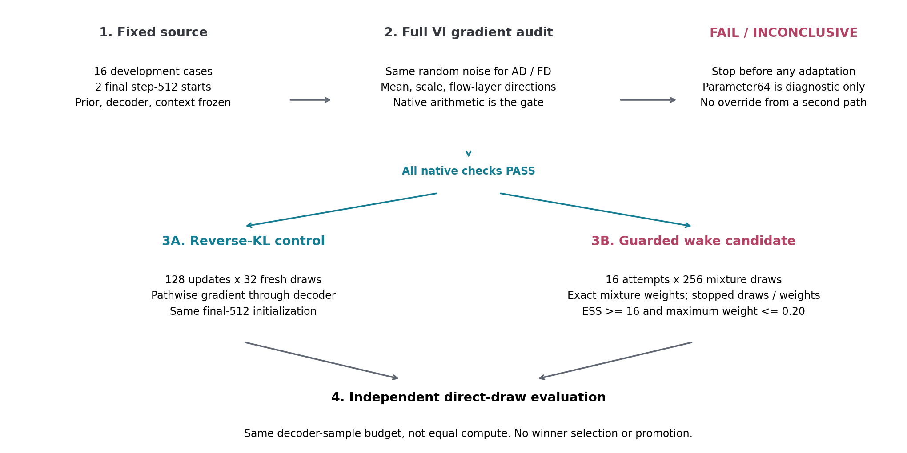
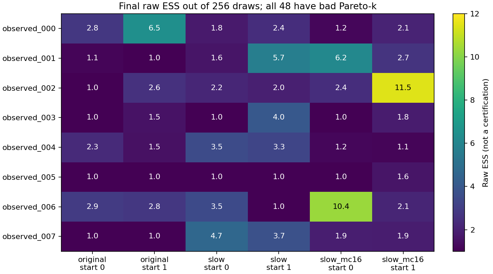

FENIKS : ou en est-on ?
============================================================

Etat au 9 septembre 2026, apres le replay 1959175
------------------------------------------------------------

**Decodeur qualifie sur les points testes. Propositions locales toujours
insuffisantes pour une inference par importance fiable. Pas de promotion
posterior ni d'apprentissage populationnel.**

Les resultats ci-dessous proviennent des journaux transmis par l'operateur.
Nous n'avons pas telecharge les artefacts Jean-Zay. Les figures d'exemples sont
des transcriptions attribuees, pas une nouvelle mesure ou un test independant.

Ce que le dernier run etablit
-----------------------------

Le job ``1959175`` a termine en 12m59s, avec contrat ``PASS`` et 16/16 cas.
Il reevalue les memes checkpoints finaux de VI locale longue, sans les modifier,
avec de nouveaux tirages : deux repetitions K2048, soit K4096 par distribution.
Les trois evaluations de gradient appartiennent au controle du contrat, pas
a un entrainement.

* Les **16/16 propositions locales observees** ont ``bad_k=1`` a K4096.
* Les **15/16 propositions locales simulees** ont ``bad_k=1`` a K4096.
* Les quatre propositions locales ayant ``bad_k=0`` a K1024 ne conservent pas
  ce resultat. Un autre cas simule passe ponctuellement a K4096.
* Les ELBO et residus des checkpoints locaux sont generalement bien reproduits,
  contrairement aux poids d'importance. Plus de tirages ne change pas la
  proposition; cela peut exposer des poids extremes jusque-la peu observes.

.. image:: _static/feniks_debug/replay_examples.png
   :alt: Replays K1024 et K4096 de checkpoints fixes, ESS/K et RMS pour deux exemples
   :width: 100%

**observed_002, depart 0 :** RMS 1.816 puis 1.810, mais ESS environ 44/1024
puis 4/4096. **simulated_003 :** l'ancre amortie conserve environ 384/4096
d'ESS avec ``bad_k=0``; les deux propositions locales donnent environ 40 et
80/4096, avec ``bad_k=1``, malgre des RMS proches de 0.89 et 0.87.
Les deux cas illustrent le mecanisme; ils ne servent pas a choisir la cohorte.

Une ESS faible n'est pas une preuve de modes manquants. Elle mesure ici une
concentration empirique des poids. Un bon ``k`` ponctuel ne certifie pas non
plus une proposition, et une petite difference entre deux estimations
d'evidence peut survenir lorsque les deux repetitions manquent la meme region.

Pourquoi changer maintenant ce que l'on teste ?
------------------------------------------------------------

Le prior fixe decrit les parametres possibles. Le decodeur calcule leurs flux.
La vraisemblance compare ces flux aux mesures et a leurs erreurs. Le reseau
amorti fournit une distribution jointe conditionnelle; la VI locale adapte
cette distribution, sans apprendre le prior ou le decodeur.

En notant :math:`x` les coordonnees latentes, :math:`y` les flux observes et
:math:`q_\phi` la proposition, l'objectif actuel est

.. math::

   \mathcal L_{\mathrm{VI}}(\phi)
   = \mathbb E_{q_\phi(x\mid y)}
     [\log q_\phi(x\mid y)-\log p(x)-\log p(y\mid x)]
   = D_{\mathrm{KL}}(q_\phi\Vert p(x\mid y))-\log p(y).

L'integration utilise en revanche les poids
:math:`w(x)=p(x)p(y\mid x)/q_\phi(x\mid y)`.
Reduire l'objectif VI n'est pas optimiser directement leur concentration.
Le replay motive une comparaison d'objectifs; il ne prouve ni que le gradient
actuel est faux, ni que la famille de flows est incapable de representer la cible.

La suite implementee : audit puis pilote correctif
------------------------------------------------------------

**Statut : prepare pour execution, pas encore mesure sur H100.**
Runbook detaille : :download:`commandes et protocole <../feniks_objective_pilot_runbook.md>`.

1. Verifier le gradient de **l'objectif VI entier**, pas seulement celui du
   decodeur. Le bruit Monte-Carlo reste fixe entre AD et differences finies.
   Deux directions par bloc couvrent moyenne, log-ecart-type et couches du flow.
   Les termes ``logq``, ``-logprior``, ``-loglike`` et leur somme sont inspectes,
   ainsi que l'identite entre la densite de tirage et la densite inverse.
2. L'arithmetique native constitue le controle principal. Une copie des
   parametres en float64 sert a localiser un probleme de precision, sans
   supprimer tous les casts float32 internes. **Cette copie ne peut pas
   autoriser le pilote si le controle natif ne passe pas.**
3. Si tous les controles natifs passent, comparer un controle reverse-KL
   (128 mises a jour, MC32) a un candidat wake (16 tentatives, 256 tirages).
   Les deux bras repartent du meme checkpoint final 512 pour chaque depart.
4. Le candidat tire dans un melange 50/50 entre sa proposition courante et
   l'ancre amortie C figee. Il apprend par log-densite inverse ponderee, avec
   **tirages et poids detaches du gradient**, sans parametre-vrai catalogue,
   sans cible ponctuelle ni banque accumulee.
5. Une tentative wake avec ESS < 16 ou poids maximal > 0.20 n'effectue aucune
   mise a jour des parametres **ni de l'etat Adam**. Elle consomme son budget;
   on ne retire pas jusqu'a obtenir un lot favorable. Tous les cas restent
   dans le rapport, y compris si aucune tentative n'est acceptee.

Le budget appaire est de 4096 evaluations de tirages par le decodeur, par bras
et par depart. **Ce n'est pas une egalite de temps, de FLOPs ou de travail de
retropropagation.** Les checkpoints sont fixes apres 1024 puis 4096 tirages
du budget d'adaptation, avec evaluations independantes K1024 puis K4096.
Le run utilise un H100, un noeud, des bras sequentiels et une allocation de 3h.

L'estimateur wake auto-normalise est biaise a K fini. Le garde-fou de
concentration introduit lui aussi une selection des mises a jour, donc peut
biaiser l'adaptation. Ce protocole est un test de correction, pas une garantie
de couverture. Le melange explore seulement ce que ses composantes proposent.
L'ancre n'est pas un posterior de reference.

La mise a jour wake de la proposition suit le principe de
`Reweighted Wake-Sleep <https://arxiv.org/abs/1406.2751>`_
et l'objectif wake-phi presente dans
`Le et al. (2020), equation 7 <https://proceedings.mlr.press/v115/le20a/le20a.pdf>`_.
L'emploi d'un melange defensif et des gardes ci-dessus est le choix local de
ce pilote; les resultats de ces articles ne valident pas FENIKS.

Comment lire la prochaine sortie
--------------------------------

* Audit ``FAIL`` : investiguer le terme et le bloc signales avant adaptation.
* Audit ``INCONCLUSIVE`` : pas de comparaison AD/FD resolue au niveau requis;
  le pilote reste bloque. Ce statut ne prouve pas un gradient incorrect.
* Audit ``PASS`` puis nombreuses tentatives wake rejetees : la proposition
  exploratoire ne fournit pas assez de poids repartis pour cette adaptation.
  Ne pas desserrer les seuils pour continuer.
* Wake accepte mais sans support meilleur sur les tirages independants :
  la correction testee ne suffit pas. Une loss wake basse n'est pas une gate.
* Amelioration conjointe ESS, queues, repetitions et prediction sur les deux
  departs : resultat de developpement a confirmer sur une cohorte independante,
  pas une autorisation automatique d'entrainement populationnel.

Le chemin parcouru
------------------

.. list-table:: Journal des decisions
   :header-rows: 1
   :widths: 16 34 50

   * - Etape / job
     - Question
     - Resultat ou decision
   * - Topologie / projection
     - Chaque coordonnee est-elle transformee ? Photometrie integree correctement ?
     - Topologie du flow et quadrature corrigees; anciens chemins conserves et versions explicites.
   * - MDF / age-SFH / 1923347
     - Les derives numeriques sont-elles coherentes ?
     - Six points spline64 qualifies. Pilote NPE termine mais support non qualifie.
   * - VI locale / 1938818
     - Une adaptation individuelle courte suffit-elle ?
     - Deux departs, 64 etapes : residus meilleurs, support souvent degrade.
   * - Controle / 1948458
     - Pas d'optimisation et bruit MC en cause ?
     - Petits pas limitent les excursions; 48/48 propositions observees finales ont mauvais k.
   * - Dispersion / 1952467
     - Elargir la base ou melanger avec l'ancre suffit-il ?
     - Non generalement : mauvais k pour 64/64 propositions observees et 63/64 simulees.
   * - VI longue / 1957394
     - 512 etapes MC32 corrigent-elles le support ?
     - Progression non uniforme; mauvais k final pour 13/16 observees et 15/16 simulees.
   * - Replay / 1959175
     - Les resultats des checkpoints fixes se reproduisent-ils a K4096 ?
     - Residus locaux generalement stables; mauvais k pour 16/16 observees et 15/16 simulees.
   * - Objectif / prepare
     - Gradient VI complet correct ? Adaptation wake plus utile que reverse-KL ?
     - Audit natif obligatoire puis comparaison figee en budget, sans selection ni promotion.

Archives visuelles : VI controlee, job 1948458
----------------------------------------------

Ces figures restent les resultats **historiques** du run court, pas ceux du
replay ni du nouveau pilote.

.. image:: _static/feniks_debug/trajectories.png
   :alt: Trajectoires historiques de deux exemples de VI courte
   :width: 100%

Fichiers et suivi
------------------------------------------------------------

Racine des experiences sur Jean-Zay::

   /lustre/fsn1/projects/rech/jrx/urx63nr/feniks_sc_drws_r29_hardmerge_20260828_002111

Dernier run termine : ``frozen_parent_long_replay_v1``, job ``1959175``.
Source des checkpoints finaux : ``frozen_parent_long_local_vi_v1``.
Prochaine destination : ``frozen_parent_objective_pilot_v1``.
Les repertoires sources ne sont pas modifies; un nouvel essai exige une
nouvelle destination. Le lanceur et le moniteur restent dans ``scripts/``.

Les recus ``FINAL.json`` et ``CONTRACT_AUDIT.json`` attestent l'execution et
les controles qu'ils enumerent, pas une promotion scientifique. Les tirages
restent disponibles dans ``cases/*/start_*/direct_draws.npz``. Le journal
long est :doc:`feniks_decoder_debug`; les commandes detaillees sont dans
``docs/feniks_objective_pilot_runbook.md``.
