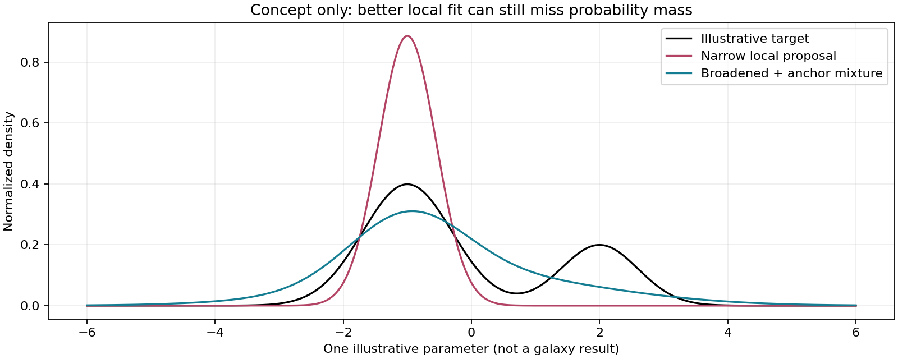

FENIKS : ou en est-on ?
============================================================

Etat au 9 septembre 2026, apres le job 1952467
------------------------------------------------------------

**Le calcul numerique a ete qualifie sur les points testes. L'inference
posterior n'est pas encore qualifiee. L'apprentissage populationnel reste bloque.**

Cette page distingue les resultats transmis par l'operateur des experiences
encore a lancer. Les figures sont reconstruites a partir des chiffres colles
dans la conversation, pas d'un acces direct aux fichiers Jean-Zay.

Dernier resultat : le probe de dispersion ne resout pas le support
========================================================================

Les 64 propositions observees et 63/64 propositions simulees du probe ont un
Pareto-k defavorable. L'elargissement uniforme et le melange teste ne suffisent
pas. Sur trois cas inspectes de l'audit precedent, l'ESS vaut environ 1 : les
deplacements ponderes ne sont donc pas des cibles d'entrainement fiables.

**Suite preparee, pas encore executee :** deux departs depuis C, 512 etapes,
learning rate 1e-4, MC32, evaluations K1024 aux etapes 64/128/256/512.
On teste progression contre plateau, sans choisir de checkpoint. Les graines
d'evaluation sont separees de celles de l'optimisation. Le prior reste gele.
Le runbook est ``docs/feniks_long_local_vi_runbook.md``.

Ce que fait le systeme
------------------------------------------------------------

Le prior decrit les parametres possibles des galaxies. Le decodeur transforme
ces parametres en flux photometriques. La vraisemblance compare ces flux aux
mesures et a leurs incertitudes. Le reseau NPE propose une **distribution
jointe** de parametres conditionnee par les flux observes.

La VI locale adapte cette distribution pour une galaxie, sans changer le prior
ni le decodeur. Son objectif est la moyenne de ``logq - logprior - loglike``
(ELBO negative). Ce n'est pas un objectif direct d'ESS.

Pour verifier les tirages, on calcule les poids proportionnels a
``exp(logprior + loglike - logq)``. Si quelques tirages portent presque tout
le poids, l'integration reste fragile meme si les flux sont mieux reproduits.
L'ESS mesure cette concentration; Pareto-k et les repetitions independantes
apportent d'autres controles. Aucun indicateur seul ne certifie le posterior.

Le chemin parcouru
------------------

1. Topologie du flow : toutes les coordonnees sont maintenant transformees.
2. Projection photometrique : correction de l'integration numerique.
3. Precision MDF puis age/SFH/masse : correction des desaccords de gradients.
4. Job 1923347 : six points de qualification passent; le pilote NPE ne
   recupere cependant pas le support posterior.
5. Job 1938818 : VI locale, 8 observations et 8 simulations, deux departs;
   les residus diminuent mais le support se degrade souvent.
6. Job 1948458 : comparaison controlee, trois reglages et deux departs chacun,
   64 etapes; termine en 21m33s. Le petit pas limite les excursions extremes,
   sans recovery generale. Les 48 fits observes finaux ont tous un mauvais k.

Ce que nous venons de tester
------------------------------------------------------------

``original`` utilise Adam a 0.001 avec 4 tirages par gradient; ``slow`` utilise
0.0001 avec 4 tirages; ``slow_mc16`` utilise 0.0001 avec 16 tirages.
Les contextes, le prior et les departs sont apparies. Les evaluations aux
etapes 8/16/32/64 utilisent deux repetitions de 128 tirages, regroupees en K256.
Les cles d'evaluation sont partagees entre reglages, mais pas avec l'optimiseur.
Les huit objets ne sont pas un echantillon de validation independant.

.. image:: _static/feniks_debug/trajectories.png
   :alt: Deux exemples montrant une baisse de RMS sans amelioration durable de l'ESS
   :width: 100%

Exemples choisis pour illustrer le mecanisme, pas une moyenne de population.
Le point zero utilise une autre realisation Monte-Carlo que les etapes locales.
La baisse de RMS ne garantit ni une bonne couverture ni un bon support.

.. image:: _static/feniks_debug/final_support.png
   :alt: ESS finale des huit objets observes pour chaque reglage et depart
   :width: 100%

Le tableau couvre tous les fits observes finaux de ce run. Les nombres sont
des ESS brutes, pas des nombres de galaxies et pas un taux de reussite.

La prochaine question
------------------------------------------------------------

La VI a-t-elle perdu une dispersion utile ? On va analyser les tirages deja
sauves, puis tester des propositions figees : base locale elargie de facteurs
1, 1.5 et 2, et melange 50/50 entre base locale elargie et proposition amortie.
La densite du melange sera calculee sur **les deux composantes pour chaque
tirage**. Ni clipping des poids, ni remplacement par un point estime.

Ces tests emploient de nouveaux tirages. Ils ne selectionnent aucun checkpoint
et ne certifient aucun enseignant NPE. Un resultat favorable devra etre confirme
sur une cohorte independante avant toute promotion. Un resultat negatif
orientera vers l'objectif ou la geometrie, sans prouver a lui seul une
impossibilite de la famille.

Schema pedagogique en une dimension, **pas un resultat FENIKS**. Elargir peut
aussi deteriorer les poids : c'est une hypothese testee, pas une correction
automatiquement benefique. Les facteurs portent sur la base du flow, pas
directement sur chaque parametre physique.

Fichiers et suivi
------------------------------------------------------------

Racine des experiences sur Jean-Zay::

   /lustre/fsn1/projects/rech/jrx/urx63nr/feniks_sc_drws_r29_hardmerge_20260828_002111

Dernier run termine : ``frozen_parent_controlled_local_vi_v1``.
Run suivant : ``frozen_parent_support_probe_v1`` (prepare par le nouveau lanceur,
pas encore execute lors de cette mise a jour).

Les recus ``FINAL.json`` et ``CONTRACT_AUDIT.json`` attestent l'execution et
le contrat numerique, pas une promotion scientifique. Les tirages sont dans
``cases/*/start_*/direct_draws.npz``; les trajectoires dans ``step_*/``.

Voir :doc:`feniks_decoder_debug` pour le journal historique.
