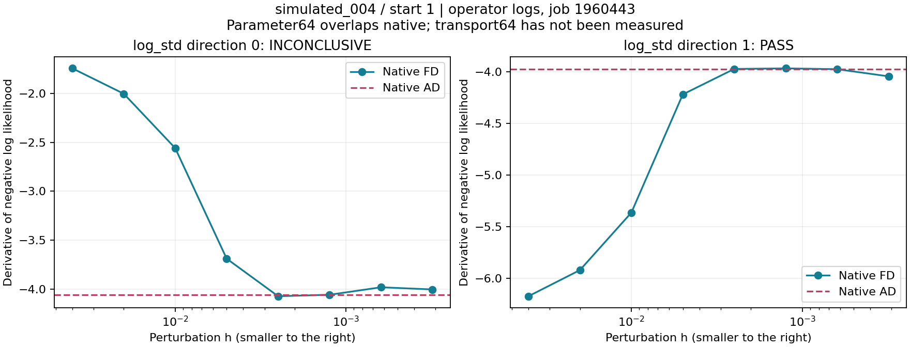

Experiment-by-Experiment Debugging Record
=========================================

Return to :doc:`feniks_debug_meeting`; definitions: :doc:`feniks_debug_metrics`.
Results below are historical operator readbacks and the repository's
:download:`debug log <../feniks_decoder_debug_log.md>`. They are not new cluster
measurements. Each experiment changes a specific part of the inference chain;
improvements across different targets, cohorts or K are not a single learning
curve. Numerical PASS applies to the tested points and directions only.

The Four Chapters
-------------------

**Experiments 01-03: improve the shared proposal.** We tested simulation-based
training and network structure. Some fits improved, but importance support
remained poor.

**Experiments 04-12: make the numerical calculation trustworthy.** We isolated
and corrected specific decoder and precision issues before continuing to
interpret optimizer behavior.

**Experiments 13-18: ask whether local adaptation solves the remaining problem.**
Longer runs, wider proposals and larger evaluation batches did not reliably
recover support. The complete conditional transport was then qualified.

**Experiments 19-22: reproduce and control harmful updates.** The reverse/wake
comparison exposed an adaptation failure; exact replay isolated overshoot.
The current guarded pilot tests the resulting correction.

For a short problem/fix/open-question recap, start at
:doc:`feniks_debug_meeting`. Below, each numbered section provides the evidence
behind one step of that story.

.. contents:: Experiments
   :local:
   :depth: 1

01. Frozen-Parent Sleep NPE
---------------------------

**Question:** can simulation-based conditional training improve the proposal
without changing the parent prior? **Protocol:** simulate from the frozen
parent, optimize conditional log-density, retain a fixed evaluation protocol.
The September 5-6 reference retained ``warm_start`` with validation sleep NLL
19.433409. Historical redshift PIT KS improved from 0.2502 to 0.1330; K1024
median ESS improved from 5.98 to 13.28, but bad-k fraction remained 0.6875.

**Learning:** sleep training can improve marginal calibration and proposal
quality without solving joint importance support. **Next:** inspect structural
coverage of the conditional flow rather than equating lower NLL with success.
These numbers are from this sleep experiment, not the epoch-160 MIRA cohort.

02. Conditional-Flow Topology
-----------------------------

**Question:** do all coordinates actually receive conditional transformations?
**Protocol:** count how often coupling blocks transform each coordinate;
repair topology while preserving the parent prior. Commit ``ecf3fb2``;
training jobs 1829245/1829247, recovery/closure 1890513/1890514.

Old transformation counts contained zeros for seven of fifteen coordinates:
``[0,6,0,6,0,6,0,6,0,6,0,6,0,6,3]``. Rebuilt counts were
``[3,3,3,3,3,2,4,2,4,3,3,3,2,4,3]``.

**Learning:** this was a concrete expressivity defect, not merely an optimizer
setting. Covering all coordinates removes that defect but does not prove
adequate conditional density or tails. **Next:** test sleep/ELBO trade-offs.

03. Balanced Sleep and ELBO Training
-----------------------------------------------------------

**Question:** does adding a physical target objective recover useful support?
**Protocol:** frozen prior, balanced sleep/ELBO variants; jobs 1893047-1893049,
implementation ``1f5462f``. Compare direct predictive fit and importance
diagnostics, not just training curves.

All four K256 support gates failed. Candidate D's normalized residual RMS was
8.64 versus A's 17.50, yet ESS/K was about 0.016 and bad-k fraction about 0.918.
**Learning:** improving flux fit can leave the proposal unusable for importance
inference. **Next:** audit gradients before interpreting further optimization.

04. Local-VI Gradient Preflight
-------------------------------

**Question:** are target gradients numerically trustworthy at the starting
points? **Protocol:** finite differences before optimization; initial job
1913341, multiscale audit 1913854 (``09bb8c7``, ``8a04db4``).

The audits could not establish the required convergence. Optimization was
blocked. **Learning:** a failed numerical qualification cannot be repaired by
more epochs. INCONCLUSIVE is distinct from a demonstrated wrong derivative.
**Next:** isolate analytic likelihood from flux computation.

05. Flux Versus Likelihood Isolation
-------------------------------------

Job 1914143 (``9660681``, 4m13) tested the analytic likelihood control
separately from redshift propagated through DSPS. The analytic control passed;
the problematic behavior remained on the flux/redshift path.

**Learning:** this localized the investigation upstream of the elementary
Gaussian likelihood. It did not validate every decoder coordinate.
**Next:** separate redshift's projection, age and other physical branches.

06. Redshift Branch Decomposition
----------------------------------

Job 1915987 (``7f48a0e``, 11m19) held the spectrum fixed for a projection
control and compared redshift contributions. The fixed-spectrum projection
discrepancy persisted in the tested 64-bit setting; the stellar branch behaved
better. **Learning:** a blanket dtype change was not a complete explanation.
**Next:** compare photometric integration against an independent reference.

07. Photometry Quadrature Reference
------------------------------------

Job 1918919 (about 7m) compared merged-grid Gauss4 and Gauss8 integration
against a piecewise reference. Both agreed with that reference; 54 band-gradient
checks at three points passed.

**Learning:** the replacement integration was locally supported by an
independent numerical construction, not by AD agreeing with itself.
**Limit:** three tested points and photometry alone are not full target
qualification. **Next:** rerun the complete decoder/target.

08. Full-Decoder Qualification
-------------------------------

Job 1920226 (``ca92735``, 33m55) exercised the integrated target and density
identities. Identities passed, but nine metallicity checks failed and other
checks remained inconclusive. A pointwise forward timing near 0.012 s versus
roughly 1 s for the legacy path was recorded; it is not a training-throughput
or multi-GPU scaling benchmark.

**Learning:** fixing projection exposed another numerical issue instead of
qualifying the complete model. **Next:** isolate metallicity-distribution
function (MDF) precision.

09. MDF Precision
------------------

Job 1921589 (``293d5a9``, 4m04) tested MDF64 and an analytic control.
The analytic control and all metallicity checks passed. Points 0, 2, 3 and 5
passed; points 1 and 4 remained inconclusive.

**Learning:** targeted precision changes solved a specific branch, not every
remaining stencil. **Next:** inspect the audit's resolution screen itself.

10. Residual Audit Resolution
------------------------------

Job 1922142 (``7824dc9``) corrected a float32 output-ULP resolution screen
being applied when the loss output was float64. Four density checks then
passed; point-4 redshift remained unresolved.

**Learning:** the test harness has its own numerical assumptions. A corrected
screen is not permission to widen tolerances until everything passes.
**Next:** trace the remaining redshift path with matched perturbations.

11. Point-4 Redshift Precision
-------------------------------

Job 1922455 tested the redshift path in float64. All-band center likelihood
passed; maximum flux shift was 2.1533e-5 photometric sigma, lsst_z AD/FD
difference 1.62e-6 and branch-sum residual approximately 1e-13.

**Learning:** this supported a small forward perturbation and a coherent
physical-redshift tangent. **Limit:** non-redshift physical coordinates were
held fixed; this is not the actual nonlinear 15D latent trajectory.
**Next:** integrate and version the precision contract.

12. Integrated Precision Night
-------------------------------

Job 1923347 (``43c2886``) enabled opt-in ``spline_precision: float64_v1``.
All six full-target inputs passed the numerical audit. Smoke, sleep and
sleep+ELBO A/B/C runs completed; all posterior-support gates failed. C had
better tails among the tested arms but was not qualified for reliable IS.

**Learning:** a numerically qualified target and a useful posterior proposal
are separate milestones. **Next:** freeze C and the parent to isolate local
adaptation. New numerical contracts require new receipts/banks, not silent
reuse under an old density interpretation.

13. Qualified and Controlled Local VI
--------------------------------------

Job 1938818 completed qualified local VI without support recovery. Job 1948458
(21m33) then compared three prescribed regimes, two starts, 64 steps, including
slower updates and MC16. All 48 observed final regime/start evaluations had
bad-k flags despite improved residuals.

.. figure:: _static/feniks_debug/trajectories.png
   :width: 100%

   Selected terminal-transcribed trajectories, job 1948458. Residuals improve
   while ESS is nonmonotonic; these are examples, not cohort averages.

.. figure:: _static/feniks_debug/final_support.png
   :width: 100%

   Final observed support across the prescribed regimes and starts. The
   underlying values are in ``docs/controlled_vi_evidence.json``.

**Learning:** a simple short-run learning-rate/MC adjustment did not restore
support. **Next:** test whether the learned local distributions are merely
too narrow, without further optimization.

14. Fixed Dispersion and Mixture Probe
---------------------------------------

Job 1952467 (6m06), ``frozen_parent_support_probe_v1``, evaluated local scales
1, 1.5 and 2 and a mixture with the amortized anchor; no optimization.
Most importance diagnostics remained poor. For observed_005/start0, increasing
scale from 1 to 2 raised RMS from 7.13 to 20.24 while ESS fraction remained
near the one-particle floor. Occasional mixture improvements were not universal.

**Learning:** uniformly widening every direction can add poor-fit draws without
repairing the missing geometry. **Next:** separate insufficient optimization
time from structural/objective limitations.

15. Long Local VI
------------------

Job 1957394 (35m43), ``frozen_parent_long_local_vi_v1``, used MC32 and 512
steps with checkpoints 64/128/256/512 and K1024 evaluations. Multiple objects
showed much better flux fits. Starts and support remained unstable; difficult
observed_005 and simulated_004 did not become reliable proposals.

**Learning:** more local optimization improves some fits but does not resolve
importance reliability. Checkpoints were saved descriptively, not selected
by their best ESS. **Next:** reevaluate fixed final checkpoints independently.

16. Final Checkpoint Replay at K4096
------------------------------------

Job 1959175 (12m59), ``frozen_parent_long_replay_v1``, changed only evaluation
draws and K, not optimization. At K4096, 31/32 local proposals had bad-k flags.
Four local proposals that passed that flag at K1024 no longer passed; another
one passed instead. Final flux-fit estimates were comparatively stable.

.. figure:: _static/feniks_debug/replay_examples.png
   :width: 100%

   Fixed final checkpoints, different K and fresh draws. Apparent support
   success can be driven by whether a rare dominant weight is sampled.

**Learning:** occasional good K1024 flags were insufficient evidence for
scaling. **Next:** audit the complete variational objective, including logq
through the conditional transport.

17. Complete VI Objective Audit
--------------------------------

Job 1960443 (5m07) checked likelihood, prior, logq, inverse density and their
value/derivative decomposition at all 32 starts. Native transport gave 31 PASS
and one INCONCLUSIVE: simulated_004/start1, log_std direction0, likelihood
and total. No optimizer ran.

At intermediate h, FD approached AD; smaller h became noisy. Log-std bounds
were inactive, and density identities passed. **Learning:** this was not
evidence for a universal sign error or clipping bug. **Next:** isolate precision
inside the conditional transport, not just at its output.

18. Transport64 Qualification
------------------------------

Job 1961888 (10m07), ``frozen_parent_transport_precision_v1``, repeated the
native reference and evaluated a promoted conditional transport at matched
points/noise. Native reproduced 31/32 PASS; transport64 passed 32/32.
Output arrays in both were float64, illustrating why output dtype alone was
insufficient. Forward differences remained small at tested centers.

   The earlier unresolved native stencil: inspect convergence across h,
   rather than selecting a single favorable finite-difference step.

**Learning:** versioned ``conditional_transport_float64_v1`` supports the next
objective comparison. It does not retroactively turn the native audit into
PASS or validate arbitrary later iterates.

19. Reverse Versus Wake Pilot
------------------------------

Job 1962310 (58m02), ``frozen_parent_objective_transport64_pilot_v1``:
32/32 fresh audits passed, then 16 cases and two starts completed. Frozen
parent/source; reverse: 128 updates x MC32; wake: 16 attempts x 256 exact
mixture draws. Both use 4096 adaptation decoder draws, but not equal total
compute: reverse requires decoder backward work; evaluations also cost time.

Wake used detached weights, a 50/50 local/amortized mixture and eligibility
ESS>=16 with maximum weight<=0.20. Only 9/32 trajectories changed; 23 did not.
The changed trajectories had lower final ESS than their paired sources.
All final reverse/wake rows had bad-k flags in this readback.

**Learning:** the audit now permits studying an actual adaptation failure.
Rejecting many batches prevents unreliable updates but does not ensure that
an eligible batch's proposed Adam step is safe. **Next:** reproduce the exact
updates and test their direction and amplitude.

20. Overnight Resource Gate
----------------------------

Job 1962505 completed in 2m11 despite a 10-hour allocation because its gate
declined the extension: ``NIGHT_EXTENSION_NOT_STARTED``.
Median ESS ratios were 1 in both groups. Eligible-trajectory fractions were
0 observed and 0.125 simulated, below 0.5; the required median ratio was 1.1
and a trajectory needed at least four applied updates. No optimization began.

**Learning:** dependency completion is not scientific success. This run saved
resources by refusing to scale an unconvincing wake method. Its short duration
was not a hidden 10-hour training success or a scheduler crash.

21. Exact Wake Forensics
-------------------------

Job 1965476 (29m28), ``frozen_parent_wake_forensics_v1``, replayed all 32
trajectories with original seeds and decisions. All final parameter differences
were zero. The nine first accepted updates were inspected on fixed batches;
AD/FD agreed locally and every directional derivative was negative.

.. figure:: _static/feniks_debug/wake_derivatives.png
   :width: 100%

   Two examples of FD convergence along the actual proposed displacement.
   Agreement supports the local direction, not the full finite update.

Seven of nine full updates nevertheless increased their own batch loss.
For observed_006/start0 it rose from 16.57 to 46.04. The two simulated_003
updates lowered batch loss but worsened independent fit metrics.

.. figure:: _static/feniks_debug/wake_loss.png
   :width: 100%

   All nine inspected first updates, not a best/worst-case selection.
   Positive change means a supposedly accepted step increased its own loss.

Prescribed scales 0, 0.01, 0.1 and 1 were evaluated with common-noise draws,
two independent replicates pooled to K4096. Full steps worsened RMS and
negative ELBO in all nine examples. Scale 0.1 improved ESS in five and RMS
in six: **a smaller universal learning rate is not a demonstrated solution**.

.. figure:: _static/feniks_debug/wake_scales.png
   :width: 100%

   Ratios to the no-update reference. Read fit and support together; a
   favorable training direction need not generalize beyond its weighted batch.

**Learning:** step overshoot is a concrete, reproducible defect. There is also
an objective/weight-generalization question that step control alone cannot
settle. Evidence: :download:`nine-update transcription <../wake_forensic_evidence.csv>`.
The 23 unchanged trajectories remain in the complete replay report.

22. Corrected Wake Descent: Currently Running
---------------------------------------------

``frozen_parent_wake_descent_v1``, contract ``wake_armijo_v1``, introduced in
``dcdd6d6``. Same source, seeds, cases and budget as the completed pilot;
reverse remains a control. Fresh numerical audits still block optimization
unless all required checks pass.

Adam proposes a displacement; the implementation tests scales 1 through
1/2048, accepts the first finite strict descent satisfying Armijo and otherwise
retains both parameters and optimizer state. Extra trials evaluate the network
density, not the decoder, but their runtime/count is recorded.

**What this tests:** whether enforcing actual batch descent prevents the
reproduced overshoot while allowing useful independent support improvements.
It does not train the shared amortized network or learn a population prior.
The operator reports it running; no final result is available in this dossier.

**Decision after completion:** first check every accepted loss change, then
paired independent ESS, k, maximum weights, residuals and acceptance counts
across both starts and both groups. More accepted updates alone is not success.
If descent passes but support does not, the next question is proposal/weight
quality and generalization, not another unconstrained increase in runtime.
Scaling to global AVI/RWS needs a separately frozen independent-cohort test;
historical calibration scores cannot stand in for that result.

Launch/readback protocol: :download:`wake descent runbook
<../feniks_wake_descent_runbook.md>`. This correction addresses a specific
optimizer failure; it does not yet establish a generally reliable RWS method.
