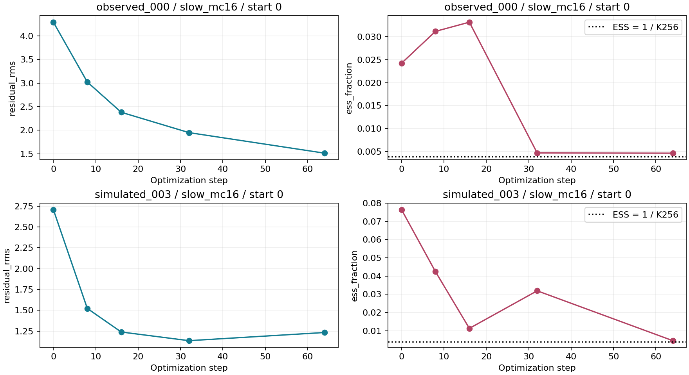
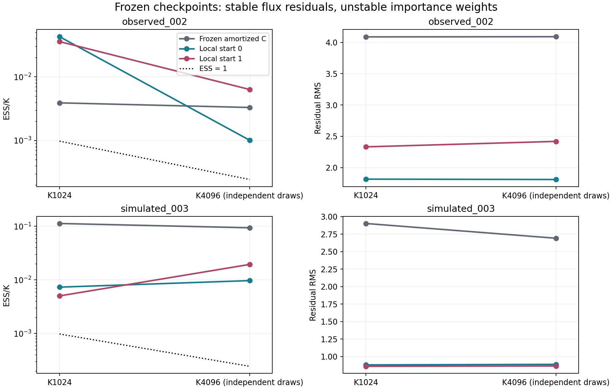
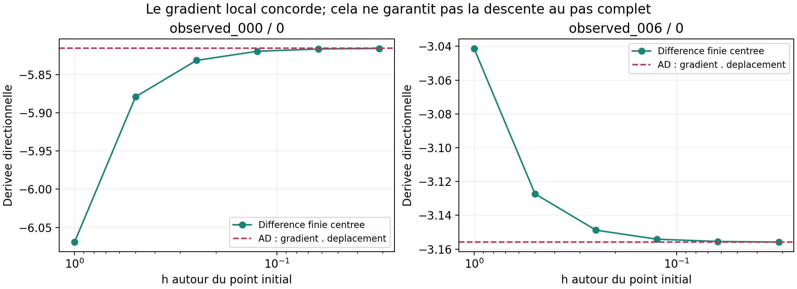
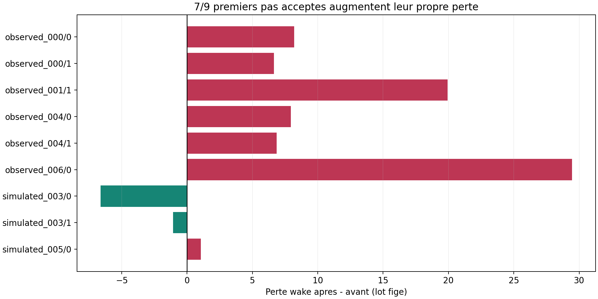
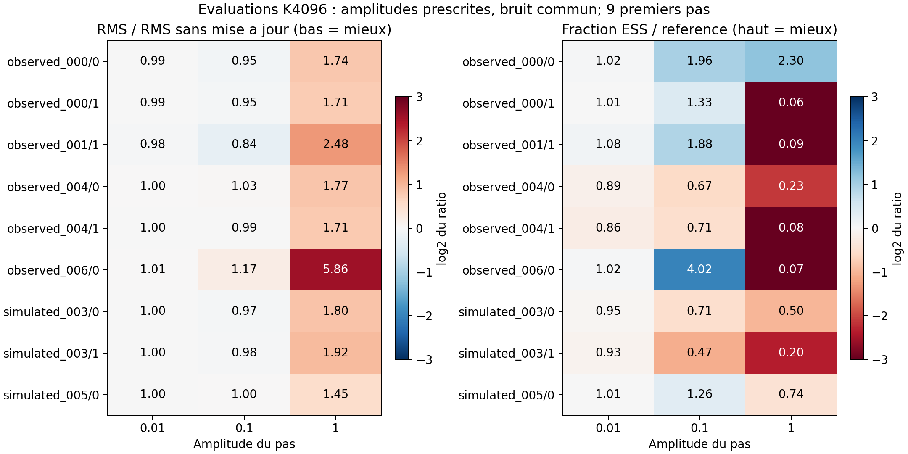

FENIKS : du debug numerique a une adaptation controlee
==========================================================================

Support de reunion, 10 septembre 2026
-------------------------------------

Question scientifique : obtenir une distribution jointe fiable des parametres
d'une galaxie a partir de ses flux. Le reseau amorti propose cette distribution;
le prior et le decodeur definissent la cible. La VI locale et wake adaptent la
proposition pour un objet. Un bon ajustement des flux ne suffit pas a valider
les incertitudes ou les poids d'importance.

Les resultats historiques sont transcrits des journaux Jean-Zay fournis par
l'operateur. Les nouveaux plots utilisent :download:`les neuf premiers pas
acceptes <../wake_forensic_evidence.csv>` du job 1965476. Ils ne sont ni des
mesures independantes ni une selection des meilleurs objets. Les 23 trajectoires
sans mise a jour sont conservees dans les rapports de rejeu.

Le fil des experiences
-----------------------

.. list-table:: Hypothese, controle, implication
   :header-rows: 1
   :widths: 22 38 40

   * - Etape
     - Ce que nous avons teste
     - Ce que nous avons appris
   * - NPE sleep et topologie du flow
     - Distribution amortie puis couverture des coordonnees par les couplages.
     - Defaut structurel corrige; les poids restent concentres. Perte sleep et support sont distincts.
   * - Sleep/ELBO equilibres
     - Ajustement des flux et support, prior fixe.
     - Des residus meilleurs ne suffisent pas : les quatre gates de support echouent.
   * - Preflight VI et decodeur
     - Differences finies, vraisemblance analytique, branches redshift/projection/age/IGM.
     - Le controle de vraisemblance passe; la projection historique et la precision necessitent une investigation.
   * - Quadrature et precision
     - Grille fusionnee Gauss4/8, reference independante; MDF64 puis chemin redshift et precision integree.
     - Les controles locaux se debloquent progressivement. Chaque changement impose un contrat versionne et une requalification.
   * - VI locale controlee (1948458)
     - Trois regimes, deux departs, 64 pas; pas plus lent et MC16.
     - Ameliorations des residus, mais poids encore concentres et variabilite des departs.
   * - Dispersion et melange (1952467)
     - Echelles locales 1/1.5/2 et ancre amortie, sans optimisation.
     - L'elargissement global ne restaure pas systematiquement le support.
   * - VI longue (1957394)
     - MC32, 512 pas et evaluations K1024.
     - Meilleur ajustement sur plusieurs objets; diagnostics d'importance encore fragiles.
   * - Rejeu K4096 (1959175)
     - Memes checkpoints, nouveaux tirages et taille accrue.
     - 31/32 propositions locales ont bad_k=1. Augmenter K ne change pas la proposition.
   * - Objectif VI entier (1960443)
     - Derivees de logq, prior, vraisemblance et identites de densite.
     - 31/32 PASS, un INCONCLUSIVE : aucun optimiseur ne demarre.
   * - Transport64 (1961888)
     - Meme point et bruit, transport conditionnel promu en precision.
     - 32/32 PASS; le chemin natif reproduit son cas non concluant.
   * - Reverse/wake (1962310)
     - Meme source, budget de tirages decodeur prescrit; wake avec poids detaches.
     - Wake modifie 9/32 trajectoires, toutes avec ESS finale inferieure a leur source. Budget decodeur egal ne signifie pas cout total egal.
   * - Rejeu forensic (1965476)
     - Memes graines; premier pas accepte, AD/FD et amplitudes fixes.
     - 32/32 rejeux exacts; 7/9 pas augmentent la perte du lot. Le controle du pas manque.
   * - Extension nocturne (1962505)
     - Gate d'acceptation et gain ESS avant entrainement.
     - Refusee : NIGHT_EXTENSION_NOT_STARTED. Aucune optimisation longue effectuee.

Les details des premieres corrections, les jobs et les limitations sont dans
:download:`le journal chronologique complet <../feniks_decoder_debug_log.md>`.
Les pages :doc:`feniks_decoder_debug` et :doc:`feniks_current_status` conservent
les controles numeriques et les resultats intermediaires.

Pourquoi les pertes et les poids racontent des choses differentes
-----------------------------------------------------------------

.. math::

   L_{VI}=E_q[\log q-\log p(x)-\log p(y|x)],\qquad
   w_i=\frac{p(x_i)p(y|x_i)}{m(x_i)},\qquad
   L_{wake}=-\sum_i\bar w_i\log q(x_i).

Pour wake, m est le melange exact 50/50 entre proposition locale et ancre
amortie; les tirages et poids sont figes pendant la differentiation. L'ESS
empirique vaut 1/somme des poids normalises au carre. Elle mesure leur
concentration, pas directement la couverture de tous les modes. Le diagnostic
Pareto-k renseigne sur les queues de poids; un PASS ponctuel ne certifie pas
le posterior. Les residus mesurent l'ajustement des flux sous les tirages.

Ce que le dernier diagnostic isole
-----------------------------------

Le gradient directionnel est negatif et les differences finies convergent vers
AD aux neuf premiers pas inspectes. Cela soutient la coherence locale du
gradient. Pourtant, sept pas complets augmentent leur propre perte.
La pente au depart ne garantit pas que le point final soit meilleur.

Le pas complet degrade les RMS et negative ELBO independantes dans les neuf
cas. L'amplitude 0.1 ameliore l'ESS dans cinq cas et la RMS dans six. Cela
justifie un controle du pas, pas un choix universel de learning rate.
Les deux departs de simulated_003 diminuent leur perte du lot et degradent
quand meme l'evaluation : le bruit des poids et l'objectif restent a evaluer.

Figures exportables : :download:`pertes (PDF) <_static/feniks_debug/wake_loss.pdf>`,
:download:`derivees (PDF) <_static/feniks_debug/wake_derivatives.pdf>`,
:download:`amplitudes (PDF) <_static/feniks_debug/wake_scales.pdf>`.
Reproduction : ``python scripts/plot_feniks_wake_meeting.py``.

La correction et le prochain test
----------------------------------

Le nouveau contrat ``wake_armijo_v1`` propose un pas Adam delta, puis essaye
alpha=1, 1/2, ..., 1/2048, sur le meme lot. Il accepte le premier pas fini
strictement descendant satisfaisant

.. math::

   L(\phi+\alpha\delta)\le L(\phi)+10^{-4}\alpha\nabla L(\phi)^T\delta.

Une direction non descendante ou douze essais refuses conservent les parametres
et les moments Adam. Un pas accepte garde les nouveaux moments Adam, avec un
deplacement reduit. Les essais supplementaires evaluent logq sans appel au
decodeur; ils augmentent cependant le cout reseau. Le changement RMS de logq
sur le lot est journalise, sans etre interprete comme une KL de population.

Le pilote reprend les 16 objets, deux departs, memes graines et budgets que
1962310; reverse reste un controle. Les checkpoints d'evaluation sont prescrits.
On verifie d'abord la descente de chaque pas accepte, puis le support et les
residus independants par rapport aux sources. Il ne suffit pas d'accepter plus
de pas : il faut des gains stables avant une extension et une cohorte nouvelle
avant une conclusion de generalisation.

Cette correction porte sur wake local. Elle ne modifie pas l'AVI amortie ni
l'apprentissage du prior. La validation numerique transport64 reste disponible;
un RWS global fiable reste une etape a demontrer experimentalement.

:download:`Commandes du pilote corrige <../feniks_wake_descent_runbook.md>`.
