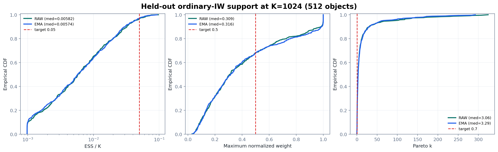
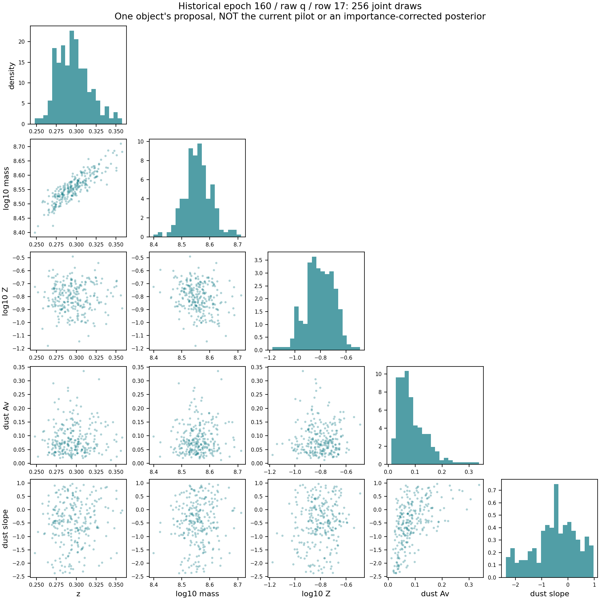
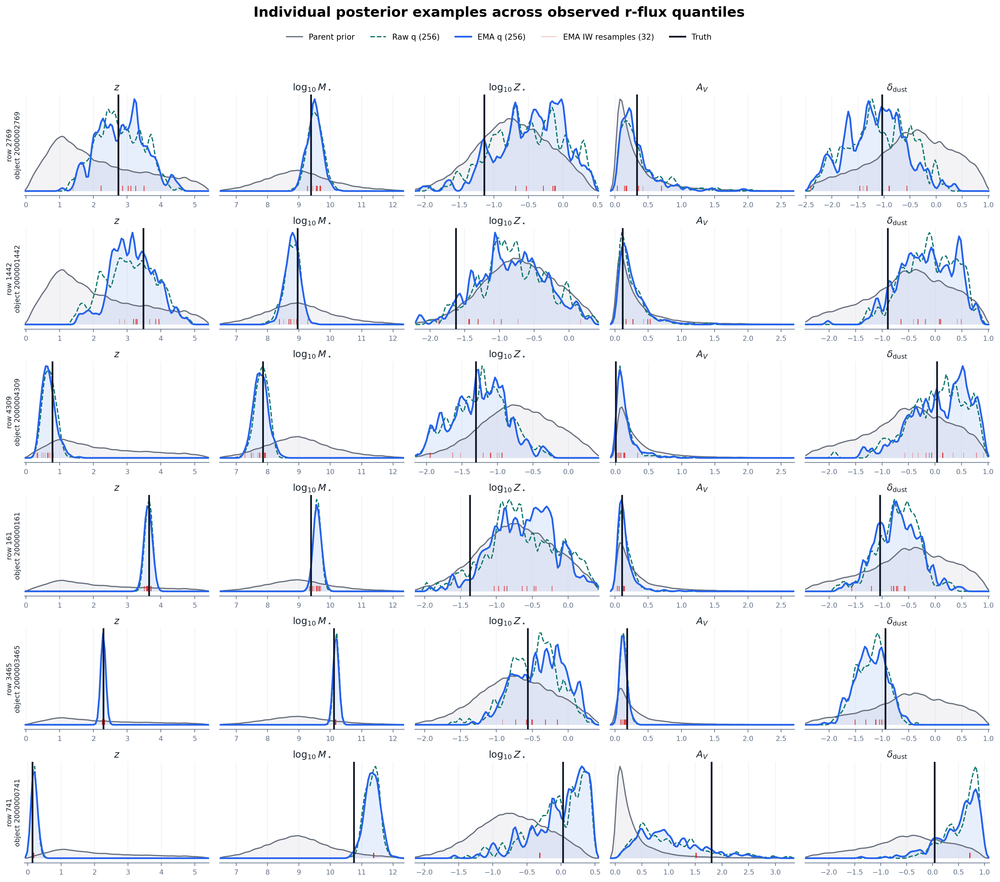
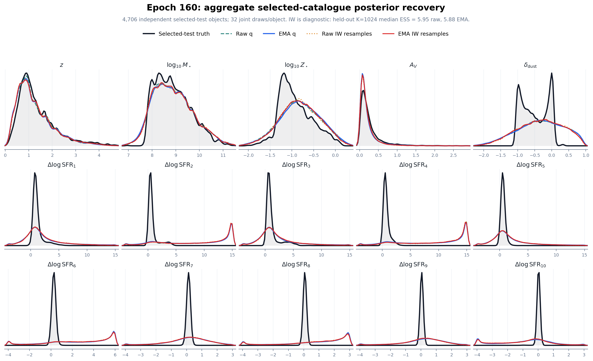
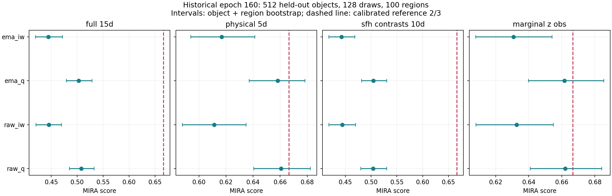

FENIKS: From Numerical Debugging to Reliable Adaptation
=======================================================================

Meeting dossier | 10 September 2026

**We want a joint conditional distribution, not a best-fit galaxy.** Redshift,
mass, metallicity, dust and SFH uncertainties must remain meaningful after
conditioning on photometry. The network proposes samples; the prior and
decoder define the target. A completed job, a decreasing loss, a good flux fit
and a calibrated posterior are four different claims.

.. contents:: On this page
   :local:
   :depth: 2

.. toctree::
   :maxdepth: 2

   feniks_debug_metrics
   feniks_debug_experiments

Where We Started
----------------

The historical large-run reference is **SC-DRWS r29, epoch 160**, with raw and
exponential-moving-average (EMA) network checkpoints and a learned parent prior.
It is frozen, not the model currently optimized in the local pilot. Its receipt
excludes truth from training and checkpoint selection; synthetic truth below
is used only for post-freeze evaluation.

Recent cluster roots share this prefix::

   /lustre/fsn1/projects/rech/jrx/urx63nr/feniks_sc_drws_r29_hardmerge_20260828_002111

The historical checkpoint directory relative to that prefix is::

   full/current_residual_6x256/seed_260826/train/checkpoints/epoch_0160

The raw-model SHA256 starts ``c6b190b28ba292d2``; the EMA hash starts
``be7a80e473c526db``. The :download:`frozen-checkpoint receipt
<_static/feniks_debug/epoch160_checkpoint.json>` records full hashes, feature
statistics and latent-transform identity.

Three evaluation populations must not be conflated:

* **512 held-out synthetic objects:** support at K=1024; MIRA below uses
  128 samples/object, 100 regions and 1,000 bootstrap draws.
* **4,706 independent observed-selected test objects:** population figures
  use an object-equal mixture of 32 joint draws/object.
* **16 development cases, two starts:** later debugging uses eight observed
  and eight simulated cases. This is not catalogue-wide calibration; simulated
  truth does not drive these local updates.

.. list-table:: Historical epoch-160 importance support
   :header-rows: 1

   * - Model
     - Median ESS / 1024
     - Fraction k > 0.7
     - 90th percentile maximum weight
   * - Raw
     - 5.95 (0.58%)
     - 82.4%
     - 0.983
   * - EMA
     - 5.88 (0.57%)
     - 83.6%
     - 0.988

**Implication:** 32 resampled particles do not provide 32 effective posterior
samples when the underlying bank has ESS near six. Finite weights are not
necessarily useful weights. The debug sequence therefore separates the
learned proposal from the physical target.

   Historical support distribution. Inspect the low-ESS tail and near-unit
   maximum weights, not only the median. This is not the running pilot.

Corner and Distribution Views
-----------------------------

   Genuine single-object corner: epoch-160 raw proposal, smallest archived
   row ID, 256 direct joint draws. Diagonals show marginal densities;
   off-diagonals retain paired coordinates. No medians replace distributions.
   Five physical coordinates are displayed, not the remaining ten SFH
   coordinates. The object was not selected by truth, fit or ESS. This is q,
   not an importance-corrected or independently qualified posterior.

   Six historical examples spanning archived observed r-band flux ranks.
   Direct q: 256 draws/object; IW: 32 diagnostic resamples/object. Spiky IW
   curves may represent particle collapse, not precise physical inference.

   Historical selected-catalogue marginals: 4,706 objects, 32 joint draws/object.
   This is an object-equal distribution mixture, not a histogram of medians.
   Compare matching selection predicates: selected population and parent prior
   are different. Marginal agreement does not validate individual conditionals.

Exports: :download:`corner PDF <_static/feniks_debug/epoch160_corner.pdf>`,
:download:`individual distributions PDF <_static/feniks_debug/epoch160_individual_posteriors_physical5d.pdf>`,
:download:`population PDF <_static/feniks_debug/epoch160_population_selected_marginals.pdf>`.
The :download:`figure manifest <_static/feniks_debug/epoch160_figure_manifest.json>`
documents cohorts, selection, draw counts, robust axis ranges and weights.

MIRA: The Joint Distribution Was Not Validated
----------------------------------------------

   Historical epoch-160 MIRA on 512 synthetic held-out objects. Dashed line:
   reference 2/3. Intervals: object + random-region bootstrap. Raw/EMA and
   direct-q/IW banks are distinct evaluations.

.. list-table:: Full-15D historical MIRA
   :header-rows: 1

   * - Bank
     - Score
     - Bootstrap 95% interval
   * - Raw q
     - 0.5080
     - [0.4853, 0.5326]
   * - Raw IW
     - 0.4451
     - [0.4204, 0.4696]
   * - EMA q
     - 0.5029
     - [0.4790, 0.5287]
   * - EMA IW
     - 0.4446
     - [0.4197, 0.4715]

Raw-q physical-5D MIRA is 0.6606, close to 2/3, while full-15D MIRA is 0.5080.
**A reassuring physical subset can hide a joint/SFH problem.** IW does not fix
this evaluation; resampling concentrated weights cannot manufacture support.

These scores do not measure the later anchor C or transport64 pilots. MIRA
requires truth paired with dense conditional draws; it cannot evaluate every
physical coordinate of real observed galaxies without corresponding truth.
See :doc:`feniks_debug_metrics` for the statistic and its limitations.

Download :download:`all MIRA groups (CSV) <_static/feniks_debug/epoch160_mira_scores.csv>`,
:download:`MIRA manifest <_static/feniks_debug/epoch160_mira_manifest.json>` and
:download:`MIRA PDF <_static/feniks_debug/epoch160_mira.pdf>`.

Which Run Is Current?
---------------------

"Latest" is a mutable monitor pointer, not a scientific model identifier.
This ledger uses supplied cluster readbacks. The current pilot is reported
running by the operator, not independently polled here.

.. list-table:: Ancestry, completed evidence and active work
   :header-rows: 1
   :widths: 24 46 30

   * - Role
     - Root relative to the shared prefix
     - Evidence/status
   * - Frozen numerical NPE anchor C
     - ``frozen_parent_precision_night_v1``
     - 1923347: target qualification passed, support failed
   * - Local initial checkpoints
     - ``frozen_parent_long_local_vi_v1``
     - 1957394: final 512-step checkpoints, two starts
   * - Completed adaptation comparison
     - ``frozen_parent_objective_transport64_pilot_v1``
     - 1962310: 16 cases complete, wake unstable
   * - Rejected long extension
     - ``frozen_parent_objective_transport64_night_v1``
     - 1962505: no optimization started
   * - Completed causal diagnostic
     - ``frozen_parent_wake_forensics_v1``
     - 1965476: 32 exact replays, nine first updates inspected
   * - Current corrected adaptation
     - ``frozen_parent_wake_descent_v1``
     - Reported running; final metrics and job ID not received

**No current-pilot corner or MIRA has been imported.** Relabeling historical
plots as current would misrepresent the evidence. The running pilot saves
joint draws and receipts; it does not itself run truth-based MIRA calibration.
The next readback must establish descent and independent support before any
larger training claim.

Read :doc:`feniks_debug_experiments` for every experiment's hypothesis,
controlled change, result, implication and remaining limitation.

Updating the Evidence
----------------------

On Jean-Zay, inspect an explicit root instead of whichever job last overwrote
the monitor environment:

.. code-block:: bash

   cd "$WORK/dsps-popcosmos"
   source "$WORK/miniconda3/etc/profile.d/conda.sh"
   conda activate shine
   BASE="/lustre/fsn1/projects/rech/jrx/urx63nr/feniks_sc_drws_r29_hardmerge_20260828_002111"
   ROOT="$BASE/frozen_parent_wake_descent_v1"
   python scripts/summarize_feniks_sc_drws_objective_pilot.py "$ROOT"
   python scripts/summarize_feniks_wake_descent.py "$ROOT"

For current distribution plots, retain ``RUN_MANIFEST.json``, ``FINAL.json``,
``OBJECTIVE_AUDIT.json``, per-case ``SUMMARY.json``, ``TRANSPORT_CONTRACT.json``,
``optimization.csv`` and ``direct_draws.npz``. Compare a declared list of
cases/starts/checkpoints; do not choose attractive plots after reading ESS.
A new MIRA assessment needs a frozen, truth-paired cohort and its own manifest.

Reproduce documentation figures locally:

.. code-block:: bash

   .venv/bin/python scripts/build_feniks_meeting_assets.py
   .venv/bin/python scripts/plot_feniks_wake_meeting.py
   .venv/bin/sphinx-build -W -b html docs/source docs/_build/html

This uses archived inputs, not cluster access. Copied figures are checked
against existing hashes. New figures retain :download:`source provenance
<_static/feniks_debug/meeting_asset_provenance.json>`. Later diagnostic figures
are labeled terminal transcriptions, not independently downloaded measurements.
